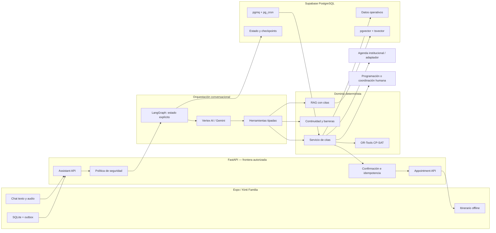
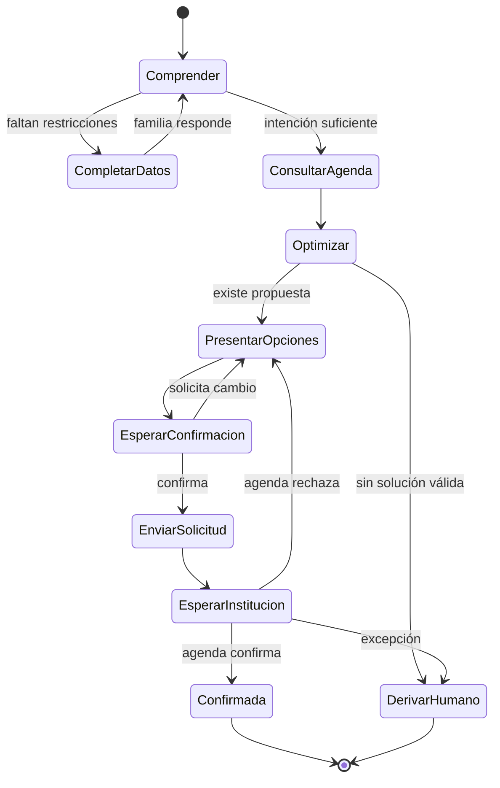

# ADR 0003 — Agente conversacional para coordinación de citas

- **Estado:** propuesto para implementación
- **Fecha:** 2026-08-14
- **Contexto:** entrevista médica y Fase 4, alcance 2.1
- **Extiende:** ADR 0001 y ADR 0002; no los reemplaza

## Contexto

La entrevista médica identifica cuatro factores modificables: seguimiento,
responsable visible, distribución de carga y organización de citas/turnos. Las
familias que viajan desde otras regiones necesitan coordinar transporte,
alojamiento y varias atenciones sin depender de una conexión continua.

Kinti ya cuenta con Expo, FastAPI, PostgreSQL/Supabase, sincronización offline,
RAG y un puerto para modelos multimodales. La nueva capacidad debe reutilizar
esa base y preservar estas reglas:

- la agenda institucional es la fuente de verdad;
- una propuesta no es una cita confirmada;
- el LLM no decide prioridades clínicas ni escribe directamente;
- las reglas y restricciones son deterministas;
- toda escritura requiere autorización, confirmación e idempotencia; y
- si no existe integración real, Kinti crea una **solicitud**, no una cita.

El dato “50 % de provincia” procede de una entrevista y se considera una
hipótesis de diseño hasta validarlo institucionalmente.

## Decisión

Se adopta una arquitectura híbrida:

1. **Gemini comprende y conversa.** Extrae intención y restricciones mediante
   function calling tipado.
2. **LangGraph controla el flujo.** Mantiene estados explícitos, pausas para
   confirmación y reanudación durable.
3. **El dominio de citas valida.** FastAPI verifica permisos, disponibilidad,
   vigencia y reglas institucionales.
4. **OR-Tools propone itinerarios.** CP-SAT resuelve restricciones de ventanas,
   dependencias, cupos y permanencia sin usar el LLM como optimizador.
5. **PostgreSQL persiste la verdad.** Conversación, solicitudes, propuestas,
   aprobaciones y auditoría se guardan fuera del prompt.
6. **Una cola durable ejecuta lo asíncrono.** Recordatorios, vencimientos y
   reintentos quedan detrás de un puerto `TaskQueue`.

## Stack recomendado

| Capa | Tecnología | Decisión |
|---|---|---|
| Aplicación móvil | Expo SDK 54, React Native, TypeScript, Expo Router | Conservar |
| Estado móvil | Zustand + SQLite + outbox | Conservar |
| API | FastAPI + Pydantic v2 | Conservar como única frontera |
| Persistencia | SQLAlchemy async + Alembic | Conservar |
| Base administrada | Supabase PostgreSQL + `pgvector` | Conservar |
| Búsqueda | `tsvector` + `pgvector` + RRF | Conservar para RAG |
| Modelo | Vertex AI, `gemini-2.5-flash` GA inicialmente | Añadir detrás de `MultimodalModel` |
| SDK del modelo | `google-genai` para Python | Añadir |
| Orquestación | LangGraph `StateGraph`/Functional API | Añadir solo al módulo de citas |
| Checkpoints | PostgreSQL, asociado a `conversation_session_id` | Añadir |
| Optimización | Google OR-Tools CP-SAT | Añadir para itinerarios múltiples |
| Tareas asíncronas | `TaskQueue` + Supabase Queues (`pgmq`) y Cron (`pg_cron`) | Añadir detrás de puerto |
| Despliegue actual | Render + Supabase + Vertex AI | Conservar en el piloto |
| Observabilidad | logs JSON, auditoría propia, métricas y OpenTelemetry | Extender |
| Pruebas | Pytest, Jest y evaluaciones determinísticas | Extender |

### Modelo

Se recomienda `gemini-2.5-flash` con identificador fijo, baja temperatura y
function calling. No se usará `latest` ni un modelo preview para acciones de
agenda. El modelo se mantiene configurable para sustituirlo después de una
evaluación comparativa.

`Gemini 3 Flash` aparece como preview en la documentación consultada; no se
elige para el piloto asistencial. `Gemini 2.5 Flash-Lite` puede evaluarse para
clasificación simple, pero no se incorpora hasta demostrar paridad en el set de
evaluación.

### Por qué LangGraph, pero limitado

Una coordinación de cita puede detenerse mientras:

- la familia responde cuándo llegará;
- confirma una alternativa;
- un programador aprueba una excepción; o
- el sistema institucional confirma la reserva.

LangGraph aporta persistencia e interrupciones human-in-the-loop. No se usará un
agente ReAct abierto ni se migrará el dominio al framework. El grafo solo
orquesta nodos tipados; FastAPI y los servicios actuales conservan reglas,
autorización y efectos.

Para un prototipo de un solo turno podría bastar una máquina de estados propia.
Se justifica LangGraph cuando la pausa/reanudación y la aprobación asíncrona sean
parte del circuito demostrado. Si esa integración no existe todavía, puede
implementarse primero la interfaz `AppointmentWorkflow` con un fake.

### Por qué OR-Tools

El lenguaje natural describe preferencias; no resuelve de manera fiable un
problema de agenda con restricciones. CP-SAT puede considerar:

- ventanas de llegada y retorno;
- dependencias entre laboratorio, consulta y tratamiento;
- duración de cada atención;
- cupos y recursos por franja;
- incompatibilidades;
- tiempo mínimo de traslado interno;
- número de días que la familia puede permanecer; y
- objetivo de reducir viajes, días y espera.

OR-Tools devuelve propuestas `FEASIBLE` u `OPTIMAL`. Si no encuentra solución,
el sistema deriva a coordinación humana; nunca inventa un turno.

## Arquitectura objetivo



## Estados del flujo



Estados mínimos persistidos:

- `collecting_constraints`;
- `proposal_ready`;
- `awaiting_family_confirmation`;
- `submitted_to_scheduler`;
- `awaiting_institution_confirmation`;
- `confirmed`;
- `rejected`;
- `expired`; y
- `human_handoff`.

## Herramientas permitidas al modelo

### Solo lectura — ejecución automática tras autorización

- `get_current_itinerary`
- `get_appointment_requirements`
- `get_available_windows`
- `search_approved_guidance`
- `get_continuity_contact`

### Propuesta — nunca escriben una cita

- `save_travel_constraints`
- `build_itinerary_proposal`
- `classify_support_barrier`

### Escritura — confirmación explícita obligatoria

- `submit_appointment_request`
- `request_reschedule`
- `report_barrier`
- `refer_social_work`

Una función de escritura crea primero una acción pendiente con `operation_id`.
FastAPI valida rol, paciente, versión, vigencia y confirmación. El modelo nunca
recibe una conexión SQL ni credenciales del sistema externo.

## División entre RAG y herramientas

| Pregunta | Fuente correcta |
|---|---|
| “¿Qué debo llevar?” | RAG con documento publicado |
| “¿Cuándo es mi cita?” | Servicio operativo autorizado |
| “¿Hay cupo el martes?” | Adaptador de agenda |
| “¿Puedo hacer laboratorio y consulta el mismo día?” | Reglas + OR-Tools |
| “No tengo dónde quedarme” | Barrera + responsable/Servicio Social |
| “¿Qué significa este resultado?” | Transferencia clínica; no responder |

## Modelo de datos propuesto

### `appointment_requests`

- `id`, `patient_id`, `requested_by`;
- `kind`: `new`, `reschedule`, `consolidate`;
- `status`;
- `reason_code`, sin texto clínico libre obligatorio;
- `source_conversation_id`;
- `operation_id` único;
- timestamps y versión.

### `travel_constraints`

- `patient_id`;
- región/ciudad declarada;
- ventana de llegada y retorno;
- días máximos de permanencia;
- necesidad declarada de alojamiento o transporte;
- conectividad preferida;
- vigencia y consentimiento.

No se inferirá vulnerabilidad a partir de la procedencia. La familia declara los
datos necesarios y puede corregirlos.

### `itinerary_proposals`

- `appointment_request_id`;
- ventanas ofrecidas;
- objetivo y restricciones aplicadas;
- estado del solver;
- versión de reglas;
- `expires_at`;
- estado: propuesta, confirmada por familia, enviada, confirmada por institución,
  rechazada o vencida.

### `appointment_slot_mirror`

Vista o caché temporal de disponibilidad institucional. Nunca se considera
fuente primaria. Cada registro incluye origen, versión y última sincronización.

## Integración con agenda

Se define un puerto:

```python
class SchedulingGateway(Protocol):
    async def availability(self, query: AvailabilityQuery) -> list[Slot]: ...
    async def submit(self, request: AppointmentRequest) -> SubmissionResult: ...
    async def status(self, external_id: str) -> ExternalStatus: ...
```

Adaptadores:

1. `FakeSchedulingGateway` para pruebas y hackatón.
2. `ManualSchedulingGateway` que crea una cola para un programador.
3. `InstitutionalSchedulingGateway` cuando exista API o integración autorizada.

Sin el tercer adaptador, la interfaz debe decir **solicitud enviada** y jamás
**cita confirmada**.

## Tareas asíncronas

Se crea un puerto `TaskQueue`. Para el stack actual se recomienda Supabase Queues
(`pgmq`) y Supabase Cron (`pg_cron`) porque conservan la infraestructura en
PostgreSQL. Las colas no se exponen al cliente móvil.

Casos de uso:

- expirar propuestas;
- consultar confirmaciones externas;
- generar recordatorios;
- reintentar notificaciones;
- detectar solicitudes estancadas; y
- escalar inasistencias.

Los consumidores siguen siendo idempotentes aunque la infraestructura anuncie
garantías de entrega.

Si el backend migra a Cloud Run, `CloudTasksQueue` puede sustituir el adaptador
sin cambiar el dominio. No se recomienda migrar desde Render solo para construir
el primer piloto.

## Seguridad y privacidad

- La procedencia regional es una restricción logística, nunca prioridad clínica.
- Se minimizan datos de viaje y se define vigencia.
- El cuidador ve citas del paciente vinculado; `patient` no organiza citas.
- Las escrituras exigen confirmación y clave idempotente.
- No se incluyen datos de pacientes en embeddings.
- El modelo recibe solo contexto mínimo de la acción.
- No se persiste razonamiento interno.
- No se usa LangSmith ni otra telemetría externa con contenido sensible por
  defecto; las trazas deben anonimizarse o permanecer bajo control institucional.
- La prioridad clínica y las dependencias proceden de reglas aprobadas, no del
  prompt.

## Resiliencia y bajo consumo

- El itinerario confirmado se almacena en SQLite para consulta offline.
- Los mensajes pendientes usan el outbox existente.
- Las respuestas son cortas y se puede elegir texto en lugar de audio.
- Una caída del modelo no bloquea la consulta del itinerario.
- Una caída de la agenda crea reintento o derivación, no una confirmación falsa.
- Los canales SMS/WhatsApp/llamada quedan detrás de `MessagingPort` y requieren
  presupuesto y aprobación independientes.

## Evaluación

### Pruebas deterministas

- el LLM no ejecuta escritura sin confirmación;
- una propuesta vencida no puede enviarse;
- el slot cambió entre propuesta y confirmación;
- reintentos conservan idempotencia;
- un cuidador no accede a otro paciente;
- `patient` no consulta ni modifica citas;
- no existe disponibilidad y se deriva a humano;
- una barrera activa continuidad/Servicio Social;
- modo offline conserva solicitud e itinerario; y
- el optimizador respeta dependencias y ventanas.

### Evaluación conversacional

- extracción correcta de origen y ventanas;
- preguntas mínimas, no interrogatorio completo;
- abstención ante datos insuficientes;
- distinción entre propuesta, solicitud y confirmación;
- lenguaje claro y no clínico; y
- transferencia de consultas clínicas.

## Alternativas descartadas

### LLM como motor de agenda

Descartado: no garantiza restricciones, disponibilidad ni consistencia.

### Agente autónomo con acceso directo a base

Descartado: rompe autorización, trazabilidad y separación entre propuesta y
acción.

### Migrar todo a microservicios

Descartado para el piloto: aumenta operación sin resolver el riesgo principal.
Se mantiene un monolito modular FastAPI.

### Gemini 3 preview

Descartado inicialmente por estado preview. Puede evaluarse fuera del circuito
de escritura cuando exista una versión GA y un set de evaluación aprobado.

### Predicción de abandono

Fuera de esta decisión. La entrevista no constituye un dataset y la procedencia
no debe convertirse en etiqueta de riesgo automática.

## Consecuencias

- Se añaden `google-genai`, LangGraph y OR-Tools al backend cuando comience la
  implementación, no antes.
- El dominio de citas y sus tablas se crean con Alembic.
- El OpenAPI crecerá con solicitudes, propuestas e itinerario.
- La primera integración usa un gateway fake o manual.
- La confirmación real depende de una fuente institucional autorizada.
- La ampliación del agente no estará cerrada hasta probar seguridad,
  idempotencia, offline y distinción entre propuesta/solicitud/confirmación.

## Fuentes técnicas

- [Vertex AI — function calling](https://docs.cloud.google.com/vertex-ai/generative-ai/docs/multimodal/function-calling)
- [Google Gen AI SDK para Vertex AI](https://cloud.google.com/vertex-ai/generative-ai/docs/sdks/overview)
- [Google OR-Tools — constraint optimization](https://developers.google.com/optimization/cp/)
- [LangGraph — durable execution y human-in-the-loop](https://docs.langchain.com/oss/python/langgraph/overview)
- [LangGraph — interrupts](https://docs.langchain.com/oss/python/langgraph/interrupts)
- [Supabase Queues](https://supabase.com/docs/guides/queues)
- [Supabase Cron](https://supabase.com/docs/guides/cron)
- [Supabase — búsqueda híbrida](https://supabase.com/docs/guides/ai/hybrid-search)
