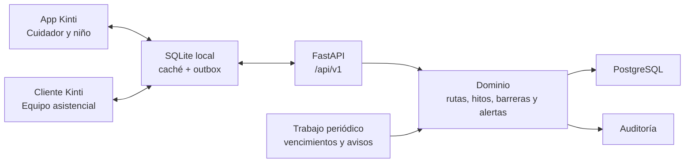

# Kinti — Fase 2: piloto conectado y continuidad entre dispositivos

> Prompt de ejecución para Codex. Debe utilizarse sobre el repositorio existente de Kinti después de leer completamente la Fase 1, su README, las instrucciones del repositorio y el código actual. Esta fase convierte el prototipo local en un piloto técnico conectado, todavía con datos exclusivamente sintéticos y sin integración con sistemas reales del INSNSB.

## 1. Rol del agente

Actúa como arquitecto de software, desarrollador móvil y desarrollador backend senior con experiencia en aplicaciones sanitarias, sincronización offline, control de acceso y protección de datos.

Tu responsabilidad no es reconstruir Kinti desde cero. Debes evolucionar de manera incremental la Fase 1 terminada, conservar sus flujos y demostrar continuidad entre dispositivos mediante una API y una base de datos reales.

Antes de modificar cualquier archivo:

1. Lee completamente `AGENTS.md`, `CLAUDE.md`, `README.md`, `phases/KINTI_FASE_1_CODEX.md`, `package.json`, `app.json` y este documento.
2. Inspecciona `app/`, `src/types/`, `src/logic/`, `src/state/` y las pruebas existentes.
3. Ejecuta la validación inicial de la Fase 1 y registra los resultados.
4. Revisa el estado de Git y conserva cualquier cambio preexistente del usuario.
5. No cambies de Expo SDK ni actualices dependencias de forma general sin una necesidad demostrable.
6. No uses datos personales, números de teléfono, historias clínicas ni diagnósticos reales.
7. Si una decisión menor no está definida, elige la alternativa más simple que preserve el flujo completo y documenta la decisión.

## 2. Punto de partida verificado

La Fase 1 ya está completa y no debe reimplementarse. El repositorio contiene:

- React Native con Expo SDK 54.
- React 19.1 y React Native 0.81.5.
- Expo Router 6 con rutas diferenciadas para cuidador, niño y equipo asistencial.
- TypeScript estricto.
- Zustand con persistencia en AsyncStorage.
- Datos sintéticos de Lucía, Mateo y Valentina.
- Lógica pura y probada para riesgo operativo y alertas.
- 23 pruebas unitarias en verde.
- Flujos terminados de cuidador, niño y equipo asistencial.
- Exportación Android y web comprobada.

Decisiones existentes que se deben preservar:

- El semáforo representa riesgo operativo de interrupción, no gravedad clínica.
- `OperationalRisk` y `RouteStatus` son valores derivados de hitos y alertas; no son editables directamente.
- La familia puede confirmar o reportar una barrera, pero no cerrar alertas asistenciales.
- El equipo asistencial puede registrar hitos, contactar a la familia, intervenir, reprogramar y resolver alertas.
- El rol no se persiste en el modo de demostración local.
- El modo actual debe seguir funcionando como respaldo aunque el backend no esté disponible.
- Expo SDK 54 se conserva para mantener compatibilidad con Expo Go durante el desarrollo y la demostración.

No elimines las pruebas existentes ni reduzcas su cobertura para hacer pasar la nueva implementación.

## 3. Problema que resuelve esta fase

La Fase 1 demuestra el flujo dentro de un solo dispositivo, pero no permite que una acción realizada por la familia sea recibida por un equipo asistencial en otro dispositivo. Tampoco existe una fuente central de verdad, trazabilidad de las intervenciones, control de acceso o recuperación confiable de operaciones realizadas sin conexión.

La Fase 2 debe resolver esa limitación:

> Una barrera reportada por el cuidador debe persistir aunque no haya conexión, sincronizarse al recuperarla, aparecer para el equipo asistencial en otro cliente y, después de una intervención, actualizar la ruta familiar sin duplicar operaciones ni perder información.

## 4. Objetivo de la Fase 2

Construir un piloto técnico conectado que demuestre de extremo a extremo:

1. El cuidador inicia sesión con una cuenta sintética y visualiza únicamente al paciente vinculado.
2. Consulta su ruta aunque pierda temporalmente la conexión.
3. Confirma un hito o reporta una barrera sin conexión.
4. La operación queda guardada localmente y se muestra como pendiente de sincronización.
5. Al recuperar conectividad, la operación llega una sola vez al backend.
6. El riesgo operativo se calcula nuevamente en el servidor usando sus propias reglas y su reloj.
7. El equipo asistencial inicia sesión en otro cliente y visualiza la alerta priorizada.
8. Registra contacto, intervención y, si corresponde, una nueva fecha.
9. La acción queda auditada.
10. El cuidador sincroniza y recibe la ruta actualizada.

La fase termina cuando este ciclo funciona de forma reproducible entre dos sesiones o dispositivos diferentes.

## 5. Resultado esperado

Al finalizar deben existir dos componentes ejecutables:

```text
kinti-mobile/                    Aplicación existente evolucionada
├── app/
├── src/
├── backend/                     Monolito modular FastAPI
├── phases/
├── docker-compose.yml           PostgreSQL local para desarrollo
└── README.md
```

No conviertas la solución en microservicios. La arquitectura de backend será un **monolito modular** con una única API y una única base de datos PostgreSQL.

## 6. Arquitectura seleccionada



### Aplicación móvil

- Mantener React Native, Expo SDK 54, TypeScript, Expo Router y Zustand.
- Incorporar `expo-sqlite` para caché normalizada y cola de operaciones pendientes.
- Mantener Zustand como fachada de estado de la interfaz, no como única fuente persistente.
- Incorporar `expo-secure-store` únicamente para tokens y secretos de sesión.
- Mantener AsyncStorage solo para preferencias no sensibles y migración del estado de Fase 1.
- Añadir una capa de repositorios para alternar entre modo local y modo conectado.
- Mostrar estado de conectividad, última sincronización y número de operaciones pendientes.

### Backend

- Python 3.12.
- FastAPI.
- Pydantic v2 y `pydantic-settings`.
- SQLAlchemy 2 asíncrono.
- PostgreSQL con `asyncpg`.
- Alembic para migraciones.
- Autenticación JWT para el piloto.
- Hash de contraseñas mediante una biblioteca mantenida y un algoritmo resistente como Argon2.
- Pytest para pruebas unitarias e integración.
- Ruff para formato y análisis estático.
- OpenAPI como contrato de la API.

### Base de datos

- PostgreSQL es obligatorio para ejecución del piloto.
- Proporcionar `docker-compose.yml` para desarrollo local.
- Permitir configurar una instancia PostgreSQL administrada mediante `DATABASE_URL`.
- SQLite del backend puede usarse exclusivamente en pruebas aisladas si no altera el comportamiento; no debe convertirse silenciosamente en la base del piloto.

## 7. Modos de ejecución

La aplicación debe soportar dos modos mediante configuración, sin duplicar pantallas:

### Modo local

```env
EXPO_PUBLIC_DATA_MODE=local
```

- Conserva los datos y el selector de roles de la Fase 1.
- No requiere backend.
- Sirve como respaldo para la demostración.
- Debe seguir pasando todas las pruebas existentes.

### Modo conectado

```env
EXPO_PUBLIC_DATA_MODE=remote
EXPO_PUBLIC_API_URL=http://...
```

- Muestra inicio de sesión.
- Obtiene rol y pacientes autorizados desde el backend.
- Usa caché local y outbox.
- Sincroniza con la API.
- Nunca permite escoger libremente un rol no autorizado.

No disperses condicionales de modo por todas las pantallas. Encapsula la diferencia detrás de repositorios y servicios.

## 8. Límites arquitectónicos

Organiza el código móvil de manera incremental:

```text
src/
├── domain/
│   ├── entities/
│   ├── repositories/
│   └── rules/
├── application/
│   ├── use-cases/
│   └── ports/
├── infrastructure/
│   ├── api/
│   ├── database/
│   ├── repositories/
│   ├── auth/
│   └── sync/
├── state/
├── logic/
├── components/
└── types/
```

No es necesario mover todos los archivos existentes antes de entregar valor. Refactoriza por cortes verticales y mantén imports temporales compatibles cuando sea necesario.

El backend debe organizarse por capacidades:

```text
backend/
├── app/
│   ├── api/
│   │   └── v1/
│   ├── modules/
│   │   ├── identity/
│   │   ├── patients/
│   │   ├── care_routes/
│   │   ├── milestones/
│   │   ├── alerts/
│   │   ├── interventions/
│   │   ├── feelings/
│   │   ├── audit/
│   │   └── notifications/
│   ├── core/
│   ├── jobs/
│   └── main.py
├── alembic/
├── tests/
├── pyproject.toml
└── .env.example
```

Las rutas HTTP no deben contener la lógica central. Las reglas de dominio deben ser invocables y testeables fuera de FastAPI.

## 9. Modelo de datos del backend

Implementa como mínimo:

### `users`

- `id` UUID.
- `email` o nombre de acceso sintético.
- `password_hash`.
- `role`: `caregiver` o `care_team`.
- `is_active`.
- fechas de creación y actualización.

El niño no tendrá credenciales propias en esta fase; accede a su experiencia desde la sesión del cuidador.

### `patients`

- `id` UUID.
- `display_name` ficticio.
- `age`.
- `avatar_key`.
- fechas de creación y actualización.

No persistas `operational_risk` o `route_status` como valores editables. Deben derivarse en el servidor.

### `caregiver_patient_links`

- cuidador.
- paciente.
- tipo de vínculo sintético.
- estado activo.

### `care_team_assignments`

- usuario asistencial.
- paciente asignado.
- estado activo.

### `milestones`

- mismos conceptos de la Fase 1.
- UUID.
- `version` para control de concurrencia.
- fechas en UTC.
- creador y fecha de modificación.

### `attendance_confirmations`

- hito.
- cuidador que confirma.
- fecha de confirmación.
- identificador idempotente de operación.

### `barrier_alerts`

- paciente e hito.
- categoría y nota familiar.
- estado `open`, `in_progress` o `resolved`.
- fecha de creación.
- fecha y usuario del primer contacto.
- fecha de resolución.

El riesgo de la alerta se deriva; el cliente no puede imponerlo.

### `interventions`

- alerta.
- tipo de acción.
- nota interna.
- profesional responsable.
- fecha.
- nueva fecha del hito, cuando corresponda.

### `feeling_check_ins`

- paciente.
- emoción.
- fecha.

No convertir este dato en una alerta clínica ni usarlo para priorización automática.

### `processed_operations`

- `operation_id` UUID único.
- usuario.
- tipo de operación.
- fecha de procesamiento.
- resultado resumido.

Evita que los reintentos offline dupliquen confirmaciones, barreras o intervenciones.

### `audit_events`

- actor.
- acción.
- tipo e identificador de entidad.
- fecha.
- metadatos mínimos sin secretos ni información innecesaria.

### `notification_outbox`

- destinatario.
- tipo de notificación.
- carga mínima.
- estado y número de intentos.
- fecha prevista y fecha de envío.

En esta fase puede alimentar notificaciones dentro de la aplicación. Los adaptadores de push y SMS reales son extensiones posteriores.

## 10. Reglas de dominio obligatorias

La implementación Python debe conservar paridad con `src/logic/risk.ts`:

- Verde: hito confirmado y sin barreras activas.
- Amarillo: hito pendiente de confirmación, barrera abierta o en proceso, o hito que necesita apoyo.
- Rojo: hito marcado como inasistencia o barrera abierta que supera la ventana configurable.
- La ventana inicial será de 48 horas, configurable mediante entorno.
- El riesgo del paciente es el peor riesgo entre sus hitos activos.
- El siguiente hito se determina por prioridad operativa y fecha.
- El estado de ruta familiar se deriva del siguiente hito y sus alertas.

El servidor es la autoridad sobre riesgo, estado derivado, fechas oficiales y resolución de alertas. Ignora cualquier `operationalRisk` o `routeStatus` enviado por el cliente.

Todas las fechas se almacenan en UTC y se muestran en la zona horaria `America/Lima`.

## 11. Autenticación y autorización del piloto

Implementa cuentas sintéticas para:

- cuidador de Mateo;
- cuidador de Lucía;
- profesional del equipo asistencial.

Requisitos:

- Inicio de sesión con JWT de acceso y mecanismo de renovación definido.
- Token almacenado en SecureStore.
- Cierre de sesión que elimine credenciales y datos locales vinculados a la sesión.
- El cuidador solo puede consultar pacientes vinculados a su usuario.
- El cuidador solo puede confirmar hitos, reportar barreras y registrar emociones de pacientes vinculados.
- El equipo solo puede consultar pacientes asignados.
- Solo el equipo puede crear/reprogramar hitos, marcar contacto y resolver alertas.
- Cada endpoint debe validar permisos en el servidor; ocultar botones en la interfaz no es suficiente.

No llames a esta autenticación “institucional”. Es autenticación de piloto. Prepara una interfaz de proveedor de identidad que pueda reemplazarse posteriormente por OIDC/SSO sin reescribir el dominio.

## 12. Contrato mínimo de API

Todas las rutas deben estar bajo `/api/v1` y documentadas en OpenAPI.

### Identidad

```text
POST /auth/login
POST /auth/refresh
POST /auth/logout
GET  /me
```

### Contexto familiar

```text
GET  /patients/{patient_id}/route
POST /milestones/{milestone_id}/confirmations
POST /milestones/{milestone_id}/barriers
POST /patients/{patient_id}/feelings
```

### Equipo asistencial

```text
GET  /care-team/overview
GET  /care-team/patients?risk=&status=
GET  /care-team/alerts?status=&risk=
GET  /alerts/{alert_id}
POST /alerts/{alert_id}/contact
POST /alerts/{alert_id}/resolve
POST /patients/{patient_id}/milestones
POST /milestones/{milestone_id}/reschedule
```

### Sincronización

```text
GET  /sync/bootstrap
POST /sync/operations
```

`/sync/bootstrap` devuelve el contexto autorizado completo necesario para reconstruir la caché local. Para el volumen pequeño del piloto no implementes sincronización delta compleja.

`/sync/operations` acepta un lote ordenado de comandos tipados con `operationId`. Debe devolver por cada operación:

```json
{
  "operationId": "uuid",
  "status": "applied | already_applied | rejected",
  "errorCode": null
}
```

Tipos mínimos de operación:

- `confirm_attendance`;
- `report_barrier`;
- `record_feeling`;
- `mark_family_contacted`;
- `resolve_alert`;
- `create_milestone`;
- `reschedule_milestone`.

Después de enviar operaciones, el cliente debe recuperar una instantánea canónica. No implementes CRDT ni sincronización colaborativa compleja.

## 13. Estrategia offline y de sincronización

Crear en SQLite local:

- tablas de caché para pacientes, hitos, alertas y emociones;
- tabla `outbox_operations`;
- tabla de metadatos de sincronización;
- migraciones locales versionadas.

Cada operación local debe seguir este flujo:

1. Generar `operationId` UUID.
2. Validar la acción localmente.
3. Aplicar actualización optimista a la caché y al estado visible.
4. Guardar la operación en outbox dentro de la misma transacción local cuando sea posible.
5. Intentar envío si existe conexión.
6. Reintentar con espera creciente ante errores temporales.
7. No reintentar automáticamente errores de permisos o validación.
8. Marcar la operación como aplicada, ya aplicada o rechazada.
9. Recuperar la instantánea canónica del servidor.
10. Reconciliar la interfaz sin duplicar entidades.

Reglas de conflicto:

- El servidor manda sobre fechas oficiales y estados asistenciales.
- Las acciones familiares se expresan como comandos, no como reemplazo completo de registros.
- Una operación aplicada no se ejecuta nuevamente.
- Si un hito fue modificado por el equipo mientras la familia estaba offline, conservar la versión del servidor y mostrar un mensaje comprensible.
- Nunca resolver un conflicto descartando silenciosamente una solicitud de ayuda.

## 14. Migración desde la Fase 1

No borres inmediatamente `kinti-demo-storage`.

Implementa una migración explícita y probada:

1. Detectar el estado persistido de Fase 1.
2. En modo local, conservar su comportamiento.
3. En modo conectado, no subir automáticamente datos antiguos al servidor.
4. Inicializar SQLite desde `/sync/bootstrap` después del inicio de sesión.
5. Guardar una versión de migración para no repetir el proceso.

El usuario debe poder ejecutar `Restaurar datos de demostración` únicamente en modo local o entorno de desarrollo. Nunca expongas un reset general en un entorno conectado no local.

## 15. Trabajo periódico del servidor

Implementa un comando ejecutable y testeable para:

- detectar hitos vencidos según una tolerancia configurable;
- marcarlos como `missed` cuando corresponda;
- generar eventos de auditoría;
- crear notificaciones pendientes;
- detectar barreras abiertas que hayan superado la ventana de respuesta.

El riesgo debe calcularse correctamente también al consultar, aunque el trabajo periódico todavía no haya corrido.

No uses un temporizador en memoria como única solución. Proporciona un comando idempotente que pueda ejecutarse mediante cron o un programador externo:

```text
python -m app.jobs.process_continuity
```

## 16. Cambios de experiencia de usuario

### Inicio de sesión conectado

- Formulario simple.
- Indicador de entorno de piloto y datos sintéticos.
- Errores comprensibles sin exponer detalles técnicos.
- Acceso al modo local solo en desarrollo.

### Estado de sincronización

Mostrar discretamente:

- conectado o sin conexión;
- última sincronización;
- operaciones pendientes;
- error que requiere acción.

No bloquear el reporte de una barrera por falta de conexión.

### Selector de fecha

- Mantener `QuickDatePicker` como acceso rápido.
- Añadir un selector compatible con Expo SDK 54 para elegir una fecha libre.
- La fecha final debe validarse en el servidor.

### Centro de notificaciones interno

Agregar una vista sencilla con:

- próximo hito;
- solicitud de confirmación;
- barrera recibida;
- reprogramación o alerta resuelta.

Las notificaciones push remotas son opcionales y no pueden bloquear la fase. Si se implementan, documenta que requieren development build cuando Expo Go no soporte la capacidad necesaria.

### Mascota Kinti

Mantener el componente reemplazable. Si no se proporciona una ilustración definitiva autorizada, conserva el recurso provisional y documenta el punto de sustitución. La mascota no debe retrasar el circuito de continuidad.

## 17. Seguridad, privacidad y límites clínicos

- Usar solo datos sintéticos claramente identificados.
- No almacenar tokens en AsyncStorage.
- No incluir secretos en variables `EXPO_PUBLIC_*`.
- No registrar contraseñas, tokens, notas internas completas o cargas clínicas en logs.
- Restringir CORS a orígenes configurados.
- Validar todas las entradas en el backend.
- Limitar tamaño y longitud de notas.
- Aplicar control de acceso por vínculo o asignación.
- Auditar cada escritura relevante.
- No permitir enumeración de pacientes mediante UUID ajenos.
- No presentar el riesgo operativo como gravedad médica.
- No diagnosticar, prescribir, interpretar síntomas ni generar triaje automático.
- El estado emocional no activa decisiones clínicas automáticas.
- No afirmar cumplimiento normativo o certificación de producción.

El diseño debe minimizar datos y quedar preparado para una evaluación institucional de privacidad y seguridad antes de trabajar con información real.

## 18. Pruebas obligatorias

### Backend unitario

- Paridad de las reglas de riesgo con TypeScript.
- Ventana de 48 horas.
- Priorización de hitos.
- Cálculo de estado de ruta.
- Resolución y reprogramación.
- Trabajo periódico idempotente.

### Backend de integración

- Login y renovación.
- Autorización por rol y vínculo.
- Cuidador sin acceso a paciente ajeno.
- Profesional sin capacidad sobre paciente no asignado.
- Creación de barrera.
- Resolución de alerta.
- Idempotencia de `operationId`.
- Auditoría de escrituras.
- Migraciones desde base vacía.

### Aplicación móvil

- Mantener las 23 pruebas de Fase 1.
- Repositorio local y remoto.
- Creación y persistencia de outbox.
- Reintento sin duplicación.
- Reconciliación con instantánea canónica.
- Cierre de sesión y eliminación de tokens.
- Migración desde el almacenamiento de Fase 1.
- Indicadores de sincronización.

### Prueba de contrato

- Generar o validar tipos TypeScript desde OpenAPI.
- Detectar incompatibilidades entre DTO del backend y aplicación.
- No duplicar manualmente contratos sin una prueba de paridad.

## 19. Orden de implementación

### Paso 0 — Línea base

- Ejecutar `npm run typecheck`, `npm run lint`, `npm test` y exportación de Expo.
- Registrar cualquier diferencia respecto a la bitácora.
- No continuar si la Fase 1 está rota por cambios propios.

### Paso 1 — Contratos y decisiones

- Documentar arquitectura y límites en un ADR breve.
- Definir esquema OpenAPI y modelo PostgreSQL.
- Definir comandos sincronizables e idempotencia.
- Definir estrategia de modo local/remoto.

### Paso 2 — Backend y base de datos

- Crear scaffold FastAPI modular.
- Configurar PostgreSQL y Alembic.
- Crear primera migración.
- Cargar usuarios y pacientes sintéticos.
- Añadir healthcheck y documentación.

### Paso 3 — Identidad y autorización

- Implementar login, renovación y cierre.
- Implementar permisos por rol, vínculo y asignación.
- Cubrir accesos permitidos y denegados con pruebas.

### Paso 4 — Dominio y API

- Portar reglas de riesgo a Python con pruebas de paridad.
- Implementar consultas familiares y asistenciales.
- Implementar comandos de hitos, barreras, alertas e intervenciones.
- Añadir auditoría e idempotencia.

### Paso 5 — Persistencia móvil

- Añadir SQLite y migraciones locales.
- Crear repositorios y caché.
- Crear outbox y estado de sincronización.
- Mantener modo local funcionando.

### Paso 6 — Integración móvil

- Añadir inicio de sesión conectado.
- Conectar pantallas existentes a repositorios.
- Implementar sincronización optimista y reconciliación.
- Añadir selector libre de fecha e indicadores de estado.

### Paso 7 — Trabajo periódico y notificaciones internas

- Implementar comando de continuidad.
- Añadir notification outbox.
- Mostrar notificaciones dentro de la aplicación.

### Paso 8 — Validación integral

- Ejecutar pruebas móviles y backend.
- Validar migraciones en PostgreSQL vacío.
- Validar escenario offline y duplicación.
- Ejecutar el guion de demostración en dos sesiones.
- Actualizar README y bitácora.

No avances de un paso si su criterio esencial no funciona. No ocultes una falla sustituyéndola por datos simulados sin documentarlo.

## 20. Guion de demostración de la Fase 2

La demostración debe durar entre tres y cuatro minutos:

1. Iniciar backend y PostgreSQL con datos sintéticos.
2. Abrir Kinti como cuidador de Mateo.
3. Mostrar que la ruta se obtiene del servidor.
4. Desconectar la red.
5. Reportar una barrera de transporte.
6. Mostrar que la solicitud está guardada y pendiente.
7. Recuperar la conexión y sincronizar.
8. Abrir otra sesión como equipo asistencial.
9. Mostrar a Mateo priorizado y abrir la alerta.
10. Marcar contacto, coordinar transporte y reprogramar.
11. Volver a la sesión familiar y sincronizar.
12. Mostrar la nueva fecha y la ruta actualizada.
13. Reenviar intencionalmente la misma operación y demostrar que no se duplica.
14. Mostrar el evento de auditoría correspondiente sin exponer información sensible.

Mensaje de cierre:

> Kinti no solo recuerda una cita: conserva la solicitud aunque la familia pierda conexión, avisa al equipo responsable y cierra el circuito cuando la barrera ha sido atendida.

## 21. Criterios de finalización

La Fase 2 está terminada únicamente cuando:

- el modo local de Fase 1 continúa funcionando;
- el modo conectado inicia sesión y aplica permisos reales en servidor;
- PostgreSQL se crea mediante migraciones reproducibles;
- los datos sintéticos se cargan mediante un seed documentado;
- una familia solo visualiza pacientes vinculados;
- una operación offline sobrevive al reinicio de la aplicación;
- la operación se sincroniza una sola vez al recuperar conexión;
- la alerta aparece en una segunda sesión asistencial;
- la resolución se refleja después en la sesión familiar;
- el riesgo se calcula en el servidor y no puede ser impuesto por el cliente;
- cada intervención produce auditoría;
- el trabajo periódico es idempotente;
- no hay tokens en AsyncStorage ni secretos en el repositorio;
- las 23 pruebas existentes siguen en verde;
- las nuevas pruebas móviles y backend terminan correctamente;
- TypeScript, ESLint, Pytest y Ruff terminan sin errores;
- Expo exporta Android y web sin errores;
- el README explica instalación, variables, arquitectura, migraciones, cuentas sintéticas, limitaciones y guion de demo;
- la bitácora registra lo realmente implementado y cualquier desviación.

No declares completada la fase solo porque las pantallas funcionan con mocks. El circuito debe atravesar almacenamiento local, API, PostgreSQL y una segunda sesión.

## 22. Comandos de validación esperados

Documenta y ajusta estos comandos a la implementación real:

```bash
# Aplicación
npm ci
npm run typecheck
npm run lint
npm test
npx expo export --platform android
npx expo export --platform web

# Backend
cd backend
python -m venv .venv
pip install -e ".[dev]"
alembic upgrade head
ruff check .
pytest

# Infraestructura
docker compose up -d db
python -m app.seed
python -m app.jobs.process_continuity
```

No afirmes que un comando pasó si no lo ejecutaste. Si una herramienta no está disponible, registra la limitación y valida por una alternativa equivalente cuando sea posible.

## 23. Fuera de alcance

No implementar en esta fase:

- datos reales de pacientes;
- conexión con historia clínica del INSNSB;
- integración FHIR activa;
- SSO institucional real;
- despliegue productivo;
- certificación legal o de seguridad;
- WhatsApp, SMS o llamadas reales;
- pagos o subsidios;
- inteligencia artificial predictiva;
- puntaje de riesgo clínico;
- diagnóstico, triaje o recomendación médica;
- microservicios;
- sincronización CRDT;
- analítica con herramientas que capturen datos identificables;
- panel administrativo general no necesario para el flujo principal.

Prepara adaptadores e interfaces para integraciones futuras, pero no inventes credenciales, endpoints o reglas del INSNSB.

## 24. Entregables

Al finalizar, entrega:

1. Aplicación móvil con modo local y remoto.
2. Backend FastAPI modular dentro de `backend/`.
3. Migraciones Alembic.
4. `docker-compose.yml` para PostgreSQL.
5. Seed reproducible con usuarios y pacientes sintéticos.
6. Caché SQLite y outbox móvil.
7. Autenticación de piloto y control de acceso.
8. API OpenAPI documentada.
9. Pruebas móviles, backend, autorización, idempotencia y sincronización.
10. README actualizado.
11. ADR breve con decisiones y compromisos.
12. Bitácora de Fase 2 con comandos ejecutados y resultados reales.

El informe final debe iniciar con el resultado conseguido, indicar archivos relevantes, resumir pruebas ejecutadas y declarar con claridad cualquier componente pendiente o simulado.

## 25. Instrucción corta para iniciar a Codex

> Lee completamente `AGENTS.md`, `CLAUDE.md`, `README.md`, `phases/KINTI_FASE_1_CODEX.md` y `phases/KINTI_FASE_2_CODEX.md`. Inspecciona la implementación actual y ejecuta la Fase 2 en el orden definido. Conserva el modo local y las 23 pruebas existentes. No declares terminada la fase hasta demostrar el circuito offline → API → PostgreSQL → equipo asistencial → resolución → cuidador en dos sesiones diferentes, sin duplicación y con auditoría.
