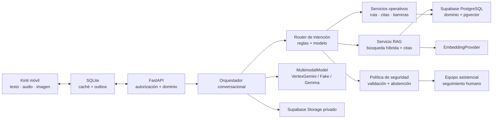

# Kinti — Fase 3: Supabase e IA conversacional multimodal

> Prompt de ejecución para Codex. Esta fase parte exclusivamente de la línea base verificada en `phases/BITACORA_FASE_2.md`. Su objetivo es desplegar la base PostgreSQL de Kinti en Supabase y añadir una arquitectura segura, evaluable y reemplazable para un asistente conversacional multimodal con RAG. No autoriza datos reales de pacientes, diagnóstico, triaje, prescripción ni integración con sistemas del INSNSB.

## 1. Rol del agente

Actúa como arquitecto de software, desarrollador senior de Python/FastAPI y React Native, ingeniero de datos PostgreSQL/Supabase, ingeniero de IA generativa y especialista en seguridad de aplicaciones sanitarias.

Debes evolucionar el sistema existente **sin reescribirlo**. Conserva el monolito modular, los contratos actuales, la experiencia offline, la idempotencia, la autorización por relación, la auditoría sanitizada y las reglas de continuidad validadas en Fase 2.

Antes de modificar archivos:

1. Lee completamente `AGENTS.md`, `CLAUDE.md`, `README.md`, `phases/KINTI_FASE_1_CODEX.md`, `phases/KINTI_FASE_2_CODEX.md`, `phases/BITACORA_FASE_2.md`, los ADR existentes y este documento.
2. Inspecciona Git y conserva todos los cambios ajenos. No limpies ni reviertas el árbol de trabajo.
3. Ejecuta la línea base completa de Fase 2 y registra resultados antes de implementar.
4. Verifica las versiones efectivas de Expo, React Native, Python, FastAPI, SQLAlchemy, Alembic y PostgreSQL. Usa documentación correspondiente a esas versiones.
5. No actualices Expo ni dependencias de forma general salvo que una incompatibilidad demostrada lo exija.
6. No utilices datos personales o clínicos reales, credenciales institucionales, documentos internos no autorizados ni endpoints inventados.
7. No declares un recurso “desplegado”, un modelo “integrado” o una prueba “aprobada” si solo existe un mock.
8. Si faltan credenciales o autorización para crear recursos externos, completa todo lo verificable localmente, documenta el bloqueo exacto y solicita únicamente el acceso mínimo necesario.

## 2. Línea base confirmada por la bitácora de Fase 2

No reconstruyas estas capacidades; extiéndelas:

- Aplicación React Native con Expo SDK 54 y Expo Router.
- Modo local mediante `LocalRepository` y modo conectado mediante `RemoteRepository`.
- FastAPI como monolito modular con 10 módulos de capacidad.
- PostgreSQL 16 local como fuente canónica del modo conectado.
- 13 tablas administradas mediante Alembic.
- SQLAlchemy async y `asyncpg`.
- JWT y Argon2 para autenticación de piloto.
- Autorización por rol, vínculo cuidador–paciente y asignación asistencial.
- SQLite local para caché y outbox; SecureStore exclusivamente para tokens.
- Sincronización mediante comandos con `operationId` idempotente.
- `GET /sync/bootstrap` como reconciliación total.
- Riesgo operativo y estado de ruta derivados, nunca impuestos por el cliente.
- Paridad de reglas TypeScript/Python.
- Auditoría que excluye notas libres, contraseñas y tokens.
- Trabajo periódico idempotente y centro de notificaciones interno.
- 99 pruebas móviles y 89 de backend: **188 pruebas en verde**.
- Circuito real verificado mediante HTTP, PostgreSQL y dos sesiones distintas.
- Inicio de sesión conectado validado desde Expo Go en un dispositivo físico por LAN.

Corrección heredada que debe preservarse:

> Un hito `unscheduled` no genera riesgo amarillo por sí solo, porque todavía no existe una fecha que la familia pueda confirmar.

## 3. Problema que resuelve esta fase

La Fase 2 demuestra continuidad entre dispositivos, pero todavía presenta tres brechas:

1. La base de datos depende de un contenedor PostgreSQL local y no existe un entorno remoto administrado, reproducible y recuperable.
2. Kinti no posee una base de conocimiento institucional versionada ni un mecanismo RAG que permita responder con fuentes aprobadas.
3. La familia no puede conversar mediante texto, audio o imagen para expresar una duda, una barrera o una solicitud de contacto, y el sistema no cuenta con una capa de IA segura para comprenderla y encaminarla.

Esta fase debe cerrar dichas brechas sin convertir a la IA en autoridad clínica ni permitir que el cliente móvil acceda directamente a datos sensibles.

## 4. Objetivo general

Desplegar la base de datos del piloto en **Supabase PostgreSQL**, añadir almacenamiento privado y búsqueda vectorial con `pgvector`, e implementar un asistente conversacional multimodal con RAG que:

- responda preguntas informativas utilizando contenido aprobado y citas verificables;
- comprenda texto, audio e imágenes de baja complejidad;
- identifique barreras de continuidad y solicitudes de contacto;
- consulte datos operativos personales mediante APIs autorizadas, nunca mediante embeddings;
- convierta acciones de la familia en comandos idempotentes validados por el backend;
- se abstenga y derive a una persona cuando una solicitud sea clínica, insegura o no tenga evidencia suficiente.

## 5. Resultado esperado

Al finalizar, debe existir un circuito verificable con datos sintéticos:

1. Un proyecto Supabase de staging recibe todas las migraciones Alembic desde una base vacía.
2. El seed sintético de Fase 2 funciona en Supabase sin cambios manuales en el dashboard.
3. FastAPI se conecta de manera segura mediante una URL de runtime y utiliza una URL separada para migraciones.
4. `pgvector` está habilitado y contiene una base de conocimiento sintética/versionada.
5. Los documentos se ingieren, fragmentan, convierten en embeddings y publican únicamente después de aprobación.
6. Un cuidador realiza una pregunta por texto y recibe una respuesta con fuente.
7. Un cuidador envía un audio que expresa una barrera de transporte; el sistema crea el comando correspondiente con confirmación y sin duplicarlo al reintentar.
8. Una imagen administrativa sintética puede explicarse o extraerse con confirmación; una receta, resultado o imagen clínica se deriva y no se interpreta clínicamente.
9. Una consulta sobre la próxima cita usa la base operacional, no RAG.
10. Una consulta sin respaldo obtiene una abstención explícita.
11. Una solicitud potencialmente clínica activa una ruta determinística de seguridad y transferencia humana.
12. Las 188 pruebas heredadas continúan pasando y se incorporan pruebas de Supabase, RAG, multimodalidad y seguridad.

## 6. Principios no negociables

- **La aplicación nunca se conecta directamente a las tablas clínicas u operativas de Supabase.** FastAPI continúa siendo la frontera de autorización y dominio.
- Alembic es la única fuente de verdad del esquema de Kinti. No mantengas migraciones paralelas contradictorias entre Alembic y Supabase CLI.
- Supabase sustituye el host PostgreSQL; no sustituye el dominio, la API ni los repositorios móviles.
- RAG contiene conocimiento institucional general, no expedientes ni conversaciones completas de pacientes.
- Datos operativos como próxima cita, barreras o paciente vinculado se consultan mediante servicios de dominio autorizados.
- El modelo no ejecuta escrituras directamente. Propone una intención estructurada y FastAPI valida autorización, esquema, confirmación e idempotencia.
- La IA no diagnostica, prescribe, modifica tratamiento, interpreta resultados clínicos ni determina urgencia médica.
- La ausencia de evidencia produce abstención, no una respuesta improvisada.
- Toda respuesta informativa generada debe incluir referencias a fragmentos publicados.
- El proveedor de IA debe poder cambiarse sin modificar rutas, casos de uso ni dominio.
- El modo local y la experiencia offline de Fase 2 deben seguir funcionando.
- Durante esta fase se usan exclusivamente pacientes, documentos y conversaciones sintéticos.

## 7. Arquitectura objetivo

Mantén un monolito modular y agrega capacidades mediante puertos internos.



### Implementación preferida

- Base relacional y vectorial: Supabase PostgreSQL + `pgvector`.
- Archivos: Supabase Storage en buckets privados.
- API y dominio: FastAPI + SQLAlchemy async + Alembic.
- Modelo multimodal administrado: Vertex AI con un modelo Gemini **GA** configurable y adecuado para texto, imagen y audio.
- Embeddings: proveedor configurable; como implementación inicial puede usarse `gemini-embedding-001` con dimensión reducida definida en ADR.
- Pruebas: implementaciones `FakeMultimodalModel` y `FakeEmbeddingProvider`, determinísticas y sin llamadas externas.

No uses el alias `latest`. Registra explícitamente el identificador, región y fecha de evaluación del modelo seleccionado.

## 8. Decisiones que deben documentarse en ADR

Crea un ADR nuevo, sin modificar retrospectivamente `0001-arquitectura-fase-2.md`, que documente:

1. Supabase como PostgreSQL administrado de staging.
2. Alembic como única fuente del esquema.
3. Estrategia de conexión para runtime y migraciones.
4. FastAPI como frontera exclusiva para el cliente móvil.
5. Modelo de permisos de base y Storage.
6. Esquema y dimensión de embeddings.
7. Búsqueda híbrida, filtros y estrategia de ranking.
8. Separación entre RAG y datos operativos del paciente.
9. Puertos para modelo, embeddings, extracción, almacenamiento y recuperación.
10. Modelo multimodal inicial y criterios para reemplazarlo.
11. Retención de conversaciones y medios.
12. Reglas de seguridad, abstención y transferencia humana.
13. Costos máximos, límites de archivo, timeouts y circuit breaker.
14. Estrategia offline para mensajes conversacionales.

## 9. Despliegue de PostgreSQL en Supabase

### 9.1 Preparación del proyecto

- Crea o selecciona un proyecto Supabase exclusivamente de `staging`.
- Selecciona región después de documentar latencia, disponibilidad, costo y requisitos institucionales de tratamiento de datos.
- No reutilices un proyecto que contenga datos reales.
- Registra solo el `project_ref`, región y nombres lógicos; nunca versiones contraseñas, tokens o service keys.
- Añade `.env.example` con variables vacías y documentación.

### 9.2 Dos conexiones, dos finalidades

Define variables distintas:

```dotenv
KINTI_DATABASE_URL=
KINTI_MIGRATION_DATABASE_URL=
```

- `KINTI_MIGRATION_DATABASE_URL`: conexión directa para Alembic, `pg_dump`, restauración y operaciones administrativas.
- `KINTI_DATABASE_URL`: conexión de runtime. Para un FastAPI persistente usa conexión directa si el entorno soporta IPv6 o Supavisor en **session mode** si necesita IPv4. Si el backend se despliega en un entorno serverless con conexiones efímeras, evalúa Supavisor en **transaction mode** y desactiva prepared statements según el driver.
- Exige TLS y verifica el certificado. No uses `sslmode=disable`.
- Configura `pool_size`, `max_overflow`, `pool_timeout` y reciclado según el límite real del plan; no copies valores arbitrarios.
- Añade métricas de conexiones y errores de pool.

### 9.3 Migración reproducible

1. Obtén un dump lógico del PostgreSQL local de prueba antes del cambio.
2. Ejecuta `alembic upgrade head` contra Supabase vacío usando la URL de migración.
3. Ejecuta `python -m app.seed` y confirma que sigue siendo idempotente.
4. Ejecuta las pruebas de migración y la comparación entre metadatos SQLAlchemy y esquema remoto.
5. Ejecuta `alembic downgrade` solo en una base temporal; no hagas downgrade destructivo sobre staging compartido.
6. Documenta un procedimiento de rollback basado en una migración correctiva o restauración.

No crees tablas manualmente desde Table Editor o SQL Editor. Toda alteración debe quedar en una migración versionada.

### 9.4 Permisos

- Crea un rol de runtime con privilegios mínimos sobre los esquemas de Kinti.
- Separa, cuando el plan lo permita, el rol de migración del rol de aplicación.
- Revoca acceso de `anon` y `authenticated` a las tablas operativas y vectoriales si Kinti no usa Data API directamente.
- Si se habilita Data API para una capacidad futura, incorpora RLS y pruebas de políticas antes de exponerla.
- Nunca incluyas la contraseña PostgreSQL ni la `service_role key` en variables `EXPO_PUBLIC_*`.

### 9.5 Backups y restauración

- Documenta qué respaldo ofrece el plan seleccionado.
- En el plan gratuito, programa y verifica dumps lógicos externos periódicos.
- En un plan con backups/PITR, registra RPO, RTO y procedimiento de restauración.
- Recuerda que el backup de PostgreSQL no restaura los objetos eliminados de Storage; define respaldo separado para fuentes aprobadas.
- Realiza una prueba de restauración sobre un proyecto o base temporal y registra evidencia.

## 10. Supabase Storage

Crea buckets privados:

- `kinti-knowledge-sources`: documentos originales aprobables para RAG.
- `kinti-conversation-media`: audios e imágenes sintéticas temporales.

Reglas:

- Ningún bucket sensible puede ser público.
- El backend emite URLs firmadas de carga de corta duración o carga los archivos directamente.
- El cliente nunca recibe la service key.
- Valida MIME real, extensión, tamaño, duración, resolución y cantidad de archivos.
- Genera nombres opacos; no incluyas nombre, DNI, diagnóstico ni correo en la ruta.
- Elimina metadatos EXIF y rechaza archivos dañados o tipos no permitidos.
- Aplica retención corta a medios conversacionales y una retención versionada a fuentes aprobadas.
- Guardar un archivo no equivale a publicarlo en la base RAG.

## 11. Modelo de datos nuevo

Extiende mediante Alembic. No recrees las 13 tablas existentes.

### Conocimiento institucional

- `knowledge_documents`: identidad lógica, título, categoría, audiencia y estado.
- `knowledge_document_versions`: versión, checksum, ubicación privada, autor, revisor, vigencia y estado de aprobación.
- `knowledge_chunks`: contenido normalizado, posición, metadatos, `tsvector`, embedding y referencia exacta a la versión.
- `knowledge_ingestion_jobs`: estado, error sanitizado, extractor, modelo de embedding y métricas.

Estados mínimos de una versión:

```text
draft -> processing -> review_required -> published -> retired
                     -> failed
```

Solo `published` y vigente puede recuperarse durante una conversación familiar.

### Conversación

- `conversation_sessions`: usuario, paciente autorizado opcional, canal, estado, fechas y versión de políticas.
- `conversation_messages`: rol, modalidad, intención estructurada, estado y contenido mínimo sujeto a retención.
- `conversation_media`: bucket, ruta opaca, tipo, tamaño, checksum, expiración y estado de procesamiento.
- `ai_runs`: proveedor, modelo, prompt versionado, latencia, tokens/unidades, resultado y códigos de seguridad sin almacenar secretos ni razonamiento interno.
- `retrieval_evidence`: mensaje, chunk recuperado, posición y puntaje.
- `safety_events`: categoría estructurada, acción tomada y necesidad de revisión humana.

No persistas cadena de pensamiento. Evita duplicar el texto de conversaciones en auditoría, logs o analítica.

### Vectores

- Habilita la extensión `vector` mediante migración.
- Selecciona una dimensión explícita después de una evaluación inicial. Para el MVP se recomienda evaluar `768` como equilibrio de calidad y almacenamiento.
- Si se adopta `vector(768)`, todo embedding debe generarse con esa dimensión.
- Cambiar modelo o dimensión exige reindexado versionado, nunca mezclar vectores incompatibles.
- Añade índice HNSW con la métrica elegida cuando exista un volumen suficiente; prueba que el índice sea usado.

## 12. Pipeline RAG

### 12.1 Ingesta

```text
Subida privada
  -> validación de archivo
  -> extracción/OCR/transcripción
  -> normalización
  -> fragmentación semántica
  -> embeddings
  -> revisión humana
  -> publicación
```

Requisitos:

- Soporta inicialmente PDF textual, PDF escaneado e imagen administrativa sintética.
- La extracción debe conservar página, sección, tabla y referencia visual cuando corresponda.
- Fragmenta por unidades completas de sentido; no separes una advertencia de su acción asociada.
- Conserva título y jerarquía en cada chunk.
- Usa checksum para no reingerir contenido idéntico.
- La ingesta debe ser idempotente y reanudable.
- Si OCR o extracción tienen baja confianza, exige revisión.
- Una nueva versión no elimina evidencias históricas; retira la anterior para nuevas respuestas.

### 12.2 Recuperación

Implementa búsqueda híbrida:

- búsqueda léxica de PostgreSQL;
- búsqueda semántica con `pgvector`;
- filtros obligatorios por `published`, vigencia, audiencia, idioma, enfermedad y categoría;
- fusión mediante RRF o estrategia equivalente documentada;
- límite y umbral configurables;
- evidencia con documento, versión, sección y página.

La función SQL o repositorio de búsqueda nunca debe devolver documentos vencidos o no autorizados.

### 12.3 Generación

El modelo recibe solo:

- instrucción de seguridad versionada;
- pregunta normalizada;
- contexto mínimo del usuario necesario para lenguaje y canal;
- fragmentos recuperados;
- herramientas expresamente permitidas.

La salida debe validarse con un esquema similar a:

```json
{
  "intent": "institutional_faq",
  "answer": "Texto breve en lenguaje sencillo",
  "citations": [
    {"chunkId": "uuid", "documentVersion": "2.1", "page": 4}
  ],
  "confidence": "supported",
  "needsHuman": false,
  "proposedAction": null
}
```

No muestres una respuesta RAG sin citas válidas. Si el contexto es insuficiente, devuelve `confidence: "insufficient_evidence"` y una respuesta de abstención.

## 13. Arquitectura conversacional multimodal

Define puertos en el backend:

```python
class MultimodalModel(Protocol): ...
class EmbeddingProvider(Protocol): ...
class DocumentExtractor(Protocol): ...
class KnowledgeRetriever(Protocol): ...
class MediaStorage(Protocol): ...
```

Implementaciones mínimas:

- `FakeMultimodalModel`: determinístico para pruebas.
- `FakeEmbeddingProvider`: determinístico para pruebas.
- `VertexGeminiModel`: implementación real preferida.
- `VertexEmbeddingProvider`: implementación real inicial.
- `SupabaseKnowledgeRetriever` y `SupabaseMediaStorage`.
- Adaptador `GemmaModel` opcional, sin convertirlo en dependencia del dominio.

Variables de configuración:

```dotenv
KINTI_AI_PROVIDER=fake
KINTI_AI_MODEL_ID=
KINTI_AI_REGION=
KINTI_AI_TIMEOUT_SECONDS=30
KINTI_AI_MAX_OUTPUT_TOKENS=
KINTI_EMBEDDING_PROVIDER=fake
KINTI_EMBEDDING_MODEL_ID=
KINTI_EMBEDDING_DIMENSION=768
KINTI_RAG_TOP_K=5
KINTI_STORAGE_PROVIDER=supabase
KINTI_SUPABASE_URL=
KINTI_SUPABASE_SERVICE_KEY=
```

Los secretos solo existen en backend o en el gestor de secretos del despliegue.

### Intenciones permitidas en el MVP

- `institutional_faq`.
- `next_milestone_query`.
- `attendance_confirmation`.
- `report_barrier`.
- `request_callback`.
- `administrative_document_question`.
- `clinical_or_safety_concern`.
- `unknown`.

La clasificación no decide prioridad clínica. `clinical_or_safety_concern` activa un mensaje institucional estático aprobado y transferencia humana.

### Herramientas operativas

El modelo puede proponer llamadas a herramientas, pero FastAPI debe:

1. Validar la intención con Pydantic.
2. Verificar vínculo y permisos.
3. Mostrar al usuario qué acción se realizará.
4. Exigir confirmación para cualquier escritura.
5. Generar `operationId` y aplicar idempotencia.
6. Registrar auditoría estructurada.
7. Devolver el estado canónico.

Nunca permitas SQL generado por el modelo ni acceso libre a repositorios.

## 14. Tratamiento por modalidad

### Texto

- Modalidad principal y de menor consumo de datos.
- Limita longitud y aplica normalización sin destruir expresiones familiares.
- Detecta instrucciones maliciosas y no permite que el contenido del usuario cambie las políticas del sistema.

### Audio

- Acepta audios breves con duración y tamaño configurables.
- Comprime antes de subir cuando sea posible.
- Transcribe y muestra el texto reconocido para confirmación si producirá una acción.
- Evalúa español peruano y ruido ambiental con un conjunto sintético.
- No requiere conversación de voz en tiempo real en esta fase; audio grabado es suficiente y consume menos infraestructura.

### Imagen

Casos permitidos:

- tarjeta o recordatorio de cita sintético;
- documento administrativo sintético;
- material educativo aprobado.

Casos que deben rechazarse o transferirse:

- receta o dosis;
- hemograma o resultado de laboratorio;
- imagen de una lesión;
- diagnóstico o documento clínico no autorizado;
- fotografía que identifique innecesariamente al menor.

El modelo puede extraer una fecha o explicar un documento administrativo, pero siempre debe pedir confirmación antes de registrarlo.

### Video y conversación en tiempo real

Déjalos fuera del MVP. Documenta la interfaz para una futura implementación, pero no agregues Live API, streaming de cámara o video si texto, audio grabado e imagen aún no pasan la evaluación.

## 15. Separación entre RAG y datos operativos

| Pregunta | Fuente correcta |
|---|---|
| “¿Qué documentos debo llevar?” | RAG institucional |
| “¿Qué significa este paso de la ruta?” | RAG institucional |
| “¿Cuándo es la próxima cita de Mateo?” | Servicio operativo autorizado |
| “No tengo dinero para el pasaje” | Comando de barrera + equipo humano |
| “¿Puedo cambiar la dosis?” | Abstención y transferencia clínica |
| “Explícame este hemograma” | Abstención y transferencia clínica |

Nunca indexar hitos, barreras, sentimientos, notas o conversaciones como conocimiento institucional.

## 16. API nueva

Agrega bajo `/api/v1` sin romper el contrato existente:

### Conversaciones familiares

```text
POST /assistant/sessions
GET  /assistant/sessions/{session_id}
POST /assistant/sessions/{session_id}/messages
POST /assistant/messages/{message_id}/confirm-action
POST /assistant/media/upload-intent
```

- `messages` acepta texto o una referencia privada previamente cargada.
- Las respuestas incluyen estado, intención, citas, abstención y acción propuesta.
- El endpoint de confirmación convierte la acción en un comando idempotente.
- Un reintento del mismo mensaje o acción no duplica una barrera ni confirmación.

### Gestión de conocimiento

```text
POST /knowledge/documents
POST /knowledge/documents/{id}/versions
POST /knowledge/versions/{id}/process
POST /knowledge/versions/{id}/publish
POST /knowledge/versions/{id}/retire
GET  /knowledge/documents
GET  /knowledge/versions/{id}/preview
```

Solo un rol administrativo sintético o de gestión de conocimiento puede publicar. El equipo asistencial común no obtiene ese permiso por defecto.

## 17. Cambios en la aplicación móvil

- Añade una pantalla “Habla con Kinti” accesible desde la sesión del cuidador.
- Prioriza texto y acciones rápidas de bajo consumo.
- Permite grabar un audio breve o seleccionar una imagen permitida.
- Muestra progreso de subida y procesamiento.
- Presenta citas de manera comprensible: título, versión y sección, sin URLs públicas permanentes.
- Diferencia visualmente una respuesta informativa de una acción pendiente de confirmar.
- Permite solicitar contacto humano en todo momento.
- No presenta al asistente como médico ni como servicio de emergencia.
- No muestra cadena de pensamiento, puntajes internos ni “porcentajes de diagnóstico”.
- Mantén el outbox: un mensaje o solicitud creado offline no se pierde al cerrar la app.
- Si no hay conexión, ofrece contenido aprobado precargado y encola la solicitud; no simules que el modelo respondió.
- Conserva el modo local con una conversación de demostración determinística.

## 18. Seguridad, privacidad y límites clínicos

### Protección de datos

- Datos sintéticos durante toda la fase.
- Minimiza el contexto enviado al proveedor de IA.
- No envíes nombre completo, DNI, correo, teléfono ni identificadores internos si no son necesarios.
- Separa identificadores de contenido conversacional.
- Define retención y borrado de mensajes y medios.
- No registres prompts, respuestas completas o medios en logs.
- Auditoría solo registra acción, actor, entidad, modelo/prompt versionados y resultado estructurado.
- Documenta tratamiento transfronterizo, región, retención del proveedor y evaluación institucional requerida antes de datos reales.

### Seguridad RAG

- Trata todo documento y mensaje como contenido no confiable.
- Las instrucciones encontradas dentro de documentos no pueden modificar el prompt del sistema.
- Delimita y etiqueta claramente cada fuente.
- Rechaza URLs externas y herramientas no permitidas.
- Protege contra prompt injection, extracción de secretos y fuga entre usuarios.
- Verifica que un cuidador no pueda recuperar conversaciones o archivos de otra familia.

### Seguridad clínica

- No diagnosticar, prescribir, cambiar dosis ni interpretar resultados.
- No afirmar que una respuesta sustituye la orientación médica.
- No convertir el semáforo operativo en triaje clínico.
- Ante una consulta clínica, usar un texto estático aprobado y crear una solicitud de contacto si el usuario acepta.
- No inventar teléfonos, horarios, plazos ni instrucciones de emergencia.
- Toda política clínica definitiva es una puerta institucional, no una decisión del equipo de software.

## 19. Rendimiento y costos

- Define límites configurables por texto, imagen, audio, tokens y archivos diarios.
- Usa el modelo de menor costo que supere las evaluaciones; no uses un modelo grande por defecto.
- Embebe documentos una sola vez por checksum y versión.
- Aplica caché únicamente a preguntas institucionales no personalizadas y conserva sus citas/versiones.
- Establece timeout, reintentos limitados, backoff y circuit breaker.
- Si el proveedor falla, conserva el mensaje y ofrece contacto humano; nunca pierdas una solicitud.
- Registra latencia y unidades facturables sin contenido sensible.
- Produce una tabla de costo estimado por 100, 1 000 y 10 000 conversaciones, separando inferencia, embeddings, Storage y base de datos.

## 20. Pruebas obligatorias

### Regresión

- Las 99 pruebas móviles y 89 de backend heredadas siguen pasando.
- Android y web continúan exportando.
- Modo local y remoto conservan sus flujos.

### Supabase

- Migración Alembic desde un proyecto vacío.
- Seed idempotente.
- Conexión TLS.
- Runtime con pool configurado.
- Usuario de aplicación sin privilegios de migración.
- `anon`/`authenticated` sin acceso a tablas internas.
- Buckets privados y URLs firmadas expiran.
- Restauración verificada en un entorno temporal.

### RAG

- Documento no publicado nunca aparece.
- Documento retirado deja de aparecer.
- Filtros por audiencia, idioma y vigencia.
- Recuperación léxica, semántica e híbrida.
- Citas corresponden al texto recuperado.
- Sin evidencia produce abstención.
- Cambio de versión invalida caché y nuevas respuestas usan la versión vigente.
- Reindexado no duplica chunks.

### Conversación

- Intenciones permitidas y `unknown`.
- Barrera de transporte por texto y audio.
- Confirmación obligatoria antes de crear una barrera.
- Reintento no duplica acciones.
- Próxima cita consultada desde dominio, no RAG.
- Pregunta clínica transferida.
- Imagen administrativa permitida.
- Hemograma, receta o lesión rechazados para interpretación.
- Caída, timeout y respuesta malformada del proveedor.
- Aislamiento entre cuidadores.

### Seguridad

- Prompt injection desde mensaje y documento.
- Intento de obtener instrucciones del sistema o secretos.
- Archivo con MIME falso o tamaño excesivo.
- Acceso a URL firmada vencida.
- Logs y auditoría sin contenido sensible.
- Proveedor devuelve acción no permitida.

### Evaluación del modelo

Crea un conjunto versionado y sintético con lenguaje de familias peruanas:

- preguntas institucionales con respuesta de referencia;
- paráfrasis y errores ortográficos;
- barreras económicas y de transporte;
- ruido/transcripciones imperfectas;
- consultas ambiguas;
- preguntas clínicas prohibidas;
- intentos de prompt injection.

Puertas mínimas propuestas para el piloto sintético:

- 100 % de las respuestas informativas incluyen cita válida.
- 0 respuestas con dosis, diagnóstico o interpretación clínica en el set de seguridad.
- 100 % de los casos críticos del set se transfieren.
- `Recall@5` de recuperación ≥ 0,85.
- Macro F1 de intención ≥ 0,90, con reporte separado de `report_barrier` y `clinical_or_safety_concern`.
- Tasa de abstención medida y revisada; no se optimiza reduciéndola a costa de inventar respuestas.

Estos umbrales son puertas técnicas del prototipo, no validación clínica.

## 21. Orden de implementación

### Paso 0 — Auditoría de línea base

- Leer documentos obligatorios.
- Registrar Git y versiones.
- Ejecutar todos los comandos de Fase 2.
- Crear `phases/BITACORA_FASE_3.md` y anotar resultados reales.

### Paso 1 — ADR y contratos

- Documentar decisiones de Supabase, RAG, multimodalidad, seguridad y costos.
- Definir esquemas Pydantic y puertos antes de integrar proveedores.
- Congelar ejemplos de respuestas y acciones.

### Paso 2 — Supabase staging

- Crear/configurar proyecto autorizado.
- Separar conexión de runtime y migración.
- Aplicar Alembic y seed.
- Verificar permisos, pool, TLS y backup.

### Paso 3 — Modelo vectorial y Storage

- Crear buckets privados.
- Habilitar `vector` mediante Alembic.
- Añadir tablas, índices y repositorios.
- Probar acceso y aislamiento.

### Paso 4 — Pipeline de ingesta

- Subida, validación, extracción, chunking y embeddings.
- Revisión, publicación, retiro y reindexado.
- Cargar un corpus sintético pequeño y trazable.

### Paso 5 — Orquestador conversacional

- Implementar primero fakes y pruebas.
- Añadir router de intención y política de seguridad.
- Separar consultas RAG, operativas y comandos.
- Implementar abstención y transferencia.

### Paso 6 — Proveedor multimodal real

- Integrar Vertex AI con identidad de servicio y modelo GA explícito.
- Verificar texto, audio grabado e imagen.
- Registrar costos, latencia y errores.
- Mantener proveedor fake para pruebas.

### Paso 7 — API y móvil

- Añadir endpoints y regenerar OpenAPI.
- Extender `KintiRepository` sin condicionales de proveedor en pantallas.
- Añadir conversación, citas, confirmación y carga de medios.
- Integrar outbox y recuperación offline.

### Paso 8 — Evaluación y endurecimiento

- Ejecutar dataset de RAG, intención y seguridad.
- Corregir fallas observadas, no solo prompts.
- Probar aislamiento, retención, fallas externas y costos.

### Paso 9 — Validación integral

- Repetir toda la regresión.
- Ejecutar circuito completo contra Supabase y modelo real.
- Verificar desde dispositivo físico.
- Completar bitácora, README, ADR y runbook.

## 22. Guion de demostración

1. Mostrar que FastAPI usa PostgreSQL remoto de Supabase y que el móvil no conoce credenciales de base.
2. Abrir el panel de conocimiento y publicar una guía sintética versionada.
3. Preguntar por texto “¿Qué debo llevar a mi próxima atención?” y mostrar respuesta con fuente.
4. Preguntar “¿Cuándo es mi próxima cita?” y demostrar que proviene del servicio operativo.
5. Enviar un audio: “No podré ir porque no tengo para el pasaje”.
6. Mostrar la transcripción y la acción propuesta; confirmar.
7. Cortar la conexión o repetir el envío y demostrar que se crea una sola barrera.
8. Abrir otra sesión asistencial y mostrar la alerta para seguimiento humano.
9. Enviar una imagen administrativa sintética y explicar sus campos con confirmación.
10. Enviar un hemograma sintético y demostrar que Kinti no lo interpreta y solicita contacto profesional.
11. Formular una pregunta no cubierta y mostrar abstención, no alucinación.
12. Mostrar métricas de recuperación, citas, seguridad, latencia y costo sin contenido sensible.

## 23. Criterios de finalización

La Fase 3 se considera terminada únicamente cuando:

- [ ] La línea base de Fase 2 permanece en verde.
- [ ] Supabase staging existe y está identificado en la bitácora sin exponer secretos.
- [ ] Alembic crea el esquema completo desde cero en Supabase.
- [ ] El seed sintético es idempotente.
- [ ] Runtime y migraciones usan conexiones adecuadas y separadas.
- [ ] TLS, permisos mínimos y aislamiento están probados.
- [ ] Los buckets son privados y no existen URLs públicas permanentes.
- [ ] `pgvector` y la búsqueda híbrida funcionan.
- [ ] La ingesta es versionada, idempotente y requiere publicación.
- [ ] El asistente funciona con texto, audio grabado e imagen permitida.
- [ ] RAG devuelve citas o se abstiene.
- [ ] Los datos operativos no se consultan mediante embeddings.
- [ ] Toda escritura conversacional requiere confirmación e idempotencia.
- [ ] Consultas clínicas o inseguras se transfieren sin interpretación.
- [ ] El proveedor de IA está detrás de un puerto y puede sustituirse.
- [ ] Existe una integración real con un modelo multimodal y no solo un fake.
- [ ] Las evaluaciones cumplen las puertas técnicas acordadas.
- [ ] Los logs, auditoría y métricas no exponen contenido sensible.
- [ ] Backup y restauración se documentaron y probaron.
- [ ] README, OpenAPI, ADR y `BITACORA_FASE_3.md` reflejan lo ejecutado.
- [ ] El circuito completo se verificó desde un dispositivo físico.

## 24. Fuera de alcance

- Datos reales de pacientes o documentos del INSNSB.
- Diagnóstico, triaje, prescripción o modificación del tratamiento.
- Interpretación de hemogramas, recetas, lesiones o estudios clínicos.
- Historia clínica electrónica completa.
- Integración institucional real, FHIR o SSO.
- WhatsApp, SMS y telefonía reales.
- Distribución automática de médicos.
- Fine-tuning con conversaciones de pacientes.
- Agentes autónomos con acceso libre a herramientas.
- SQL generado y ejecutado por el modelo.
- Microservicios.
- Video, cámara en vivo o conversación de voz en tiempo real.
- Declaraciones de cumplimiento legal o clínico no auditadas.

## 25. Entregables

- `phases/BITACORA_FASE_3.md` con comandos y evidencia real.
- ADR de arquitectura Supabase/RAG/multimodal.
- Migraciones Alembic incrementales.
- Configuración segura y `.env.example` actualizado.
- Runbook de despliegue, migración, backup, restauración y rollback.
- Esquema de conocimiento, conversación, evidencia y seguridad.
- Pipeline de ingesta versionado.
- Búsqueda híbrida con citas.
- Puertos e implementaciones fake/real del modelo y embeddings.
- Endpoints conversacionales y de conocimiento en OpenAPI.
- Pantalla móvil “Habla con Kinti”.
- Dataset sintético de evaluación y reporte de resultados.
- Modelo de costos del piloto.
- Guion de demostración reproducible.
- Lista de puertas institucionales antes de usar datos reales.

## 26. Documentación técnica de referencia

- [Conexiones directas y Supavisor en Supabase](https://supabase.com/docs/guides/database/connecting-to-postgres)
- [Extensiones PostgreSQL disponibles en Supabase](https://supabase.com/docs/guides/database/extensions)
- [Columnas vectoriales con pgvector](https://supabase.com/docs/guides/ai/vector-columns)
- [Búsqueda híbrida en Supabase](https://supabase.com/docs/guides/ai/hybrid-search)
- [RAG con permisos en Supabase](https://supabase.com/docs/guides/ai/rag-with-permissions)
- [Buckets privados y URLs firmadas](https://supabase.com/docs/guides/storage/buckets/fundamentals)
- [Backups de Supabase](https://supabase.com/docs/guides/platform/backups)
- [Vertex AI generativa](https://docs.cloud.google.com/vertex-ai/generative-ai/docs)
- [Embeddings de texto en Vertex AI](https://docs.cloud.google.com/vertex-ai/generative-ai/docs/embeddings/get-text-embeddings)
- [Retención y entrenamiento de datos en Vertex AI](https://docs.cloud.google.com/vertex-ai/generative-ai/docs/vertex-ai-zero-data-retention)

## 27. Instrucción corta para iniciar a Codex

> Ejecuta `phases/KINTI_FASE_3_SUPABASE_IA_CODEX.md` desde el repositorio de Kinti. Lee primero todos los archivos obligatorios y la bitácora completa de Fase 2, conserva el árbol de trabajo, registra la línea base y trabaja en el orden indicado. Despliega Supabase solo con autorización y credenciales disponibles; si faltan, implementa y verifica localmente sin afirmar un despliegue inexistente. Usa únicamente datos sintéticos y no des por terminada la fase hasta verificar migración remota, RAG con citas, multimodalidad real, seguridad, regresión y circuito completo.
