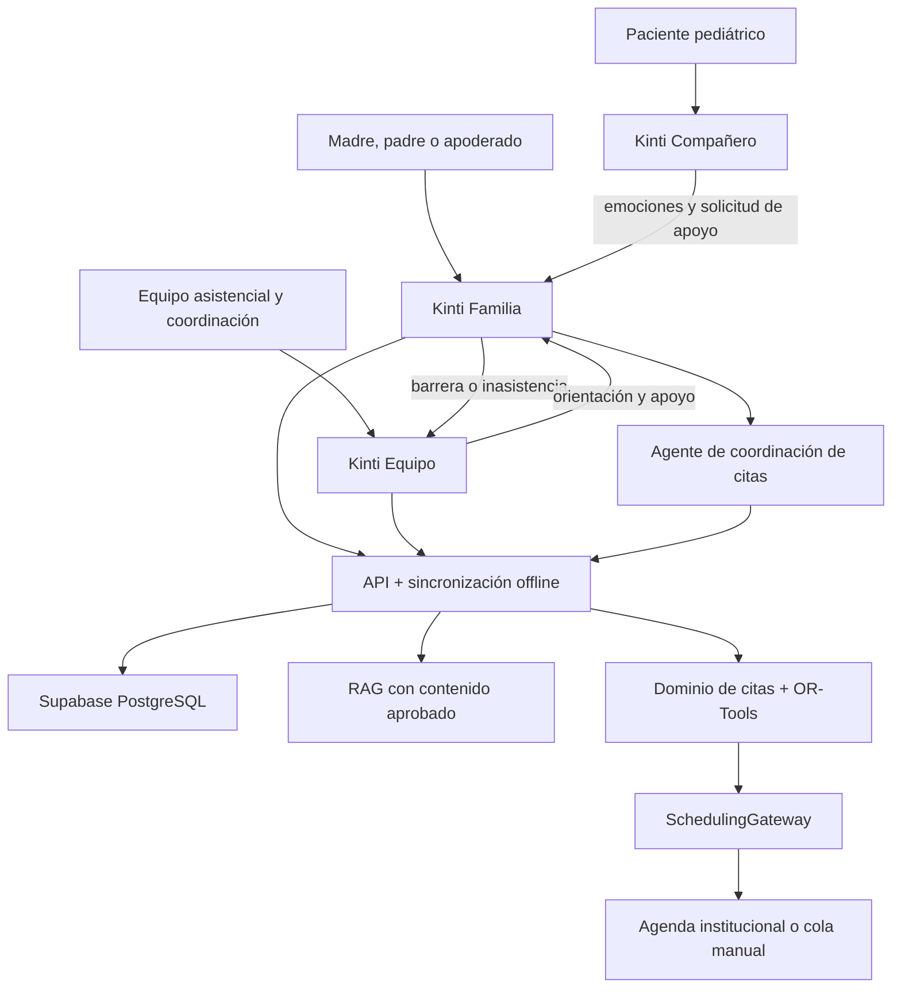

# Kinti — Fase 4: continuidad, coordinación y acompañamiento protegido

**Versión del alcance:** 2.1
**Fecha:** 2026-08-14  
**Estado:** núcleo de Fase 4 desplegado; ampliación del agente de citas diseñada y pendiente de implementación
**Fuentes:** documento oficial del Desafío 03, `phases/BITACORA_FASE_3.md`, `phases/BITACORA_FASE_4.md`, entrevista médica en Obsidian y `docs/adr/0003-agente-conversacional-citas.md`

---

## 1. Propósito

Esta fase convierte la infraestructura comprobada en Fase 3 en un producto
alineado con el **Desafío 03: Ruta Hematológica** del Instituto Nacional de
Salud del Niño San Borja.

> **Objetivo final:** prevenir y recuperar interrupciones evitables de la ruta
> hematológica mediante información oportuna para las familias, coordinación
> trazable para el equipo asistencial y una experiencia infantil voluntaria que
> acompañe emocionalmente sin trasladar al menor la responsabilidad o la carga
> informativa del tratamiento.

La ampliación conversacional permite que el cuidador consulte, prepare y
solicite la coordinación de citas en lenguaje natural. Su valor no es “chatear
con una IA”, sino convertir restricciones de viaje, alojamiento, disponibilidad
y preparación en una solicitud trazable y, cuando existan datos autorizados de
agenda, en una propuesta de itinerario que una persona debe confirmar.

El piloto puede priorizar pacientes con leucemia infantil, pero el desafío
institucional y el modelo de dominio abarcan hematología pediátrica.

Kinti no promete reducir la duración clínica del tratamiento. Busca reducir
demoras, esperas y discontinuidades evitables.

## 2. Línea base heredada de Fase 3

Fase 3 cerró con:

- Supabase y PostgreSQL/`pgvector`;
- API FastAPI desplegada;
- autenticación y aislamiento entre familias;
- caché SQLite, outbox y sincronización offline;
- ruta, hitos, alertas, intervenciones y notificaciones;
- RAG con conocimiento versionado, citas y abstención;
- captura de texto, audio e imagen detrás de proveedores sustituibles; y
- **332 pruebas en verde**.

Por tanto, Fase 4 no reconstruye Supabase, RAG ni la IA. Añade la capa de
coordinación operativa y corrige la separación de experiencias por actor.

## 3. Problema que aborda

El documento oficial describe:

- tratamientos prolongados y transiciones entre hospitalización, atención
  ambulatoria y ciclos;
- información fragmentada;
- ausencias y riesgo de abandono asociados con barreras económicas, familiares,
  educativas, geográficas e informativas;
- distribución desigual de pacientes y responsabilidades;
- capacidad limitada de Clínica de Día; y
- programación descentralizada con picos, esperas y duplicidades.

La pregunta operativa de Kinti es:

> **¿Quién perdió o puede perder continuidad, qué barrera existe, quién debe
> actuar y con qué capacidad disponible, sin responsabilizar ni abrumar al
> niño?**

## 4. Principios obligatorios de producto

### P-01. La continuidad es responsabilidad adulta e institucional

El cuidador y el equipo gestionan citas, barreras, alertas y decisiones. El
menor nunca recibe mensajes que le atribuyan la responsabilidad de asistir,
confirmar, recuperarse o “cumplir” el tratamiento.

### P-02. Acompañar no significa exponer toda la ruta clínica

El espacio infantil no mostrará por defecto el diagnóstico, la duración global,
el mapa completo del tratamiento, alertas, inasistencias, riesgos, dificultades
económicas ni información operativa del hospital.

### P-03. Información gradual, honesta y supervisada

Kinti no debe mentir ni ocultar una respuesta que corresponda brindar a un
profesional. Solo presenta contenido breve, inmediato y adecuado a la edad,
habilitado por el cuidador o por el equipo psicosocial. Una explicación clínica
no se improvisa mediante un chatbot infantil.

### P-04. Participación voluntaria

Usar el espacio infantil no es requisito para mantener la atención. No existen
rachas, castigos, pérdida de premios ni mensajes de culpa por no usarlo.

### P-05. Tecnología proporcional al contexto

Los flujos críticos de la familia deben soportar conectividad intermitente y no
depender de QR, descarga inmediata, plan pospago o conversación con IA.

### P-06. IA subordinada a reglas y personas

La IA puede facilitar lenguaje, búsqueda y clasificación, pero no diagnostica,
prescribe, realiza triaje, decide prioridad clínica, confirma citas ni decide la
distribución de personal. La agenda institucional, el dominio determinista y la
confirmación humana prevalecen sobre cualquier salida del modelo.

## 5. Arquitectura del producto: tres experiencias



### 5.1 Kinti Familia

Espacio autenticado para el cuidador. Contiene la ruta asistencial, siguiente
hito, indicaciones, confirmaciones, comunicación de barreras y asistente para
orientación no clínica.

### 5.2 Kinti Compañero

Cuenta propia del paciente con el rol restringido `patient`. Conserva identidad,
sesión, preferencias y contenido separados del cuidador. Su finalidad es el
acompañamiento emocional, la expresión y la preparación inmediata; tener una
cuenta propia no le entrega responsabilidad sobre citas o tratamiento.

El apoderado autoriza la activación, recuperación o suspensión de la cuenta,
pero para entrar a Kinti Familia debe autenticarse nuevamente como adulto. No se
permite cambiar de la sesión infantil a la sesión cuidadora con un botón simple.

### 5.3 Kinti Equipo

Espacio autenticado para personal autorizado. Contiene pacientes asignados,
alertas, intervenciones, derivaciones, carga ponderada y capacidad ambulatoria.

En producción deberá separarse el perfil clínico del perfil coordinador/gestor y,
si corresponde, del perfil de Servicio Social.

### 5.4 Agente de coordinación de citas — arquitectura objetivo

El agente pertenece a **Kinti Familia** y no a Kinti Compañero. Reutiliza la API
FastAPI como única frontera y se implementa como un flujo tipado, no como un
agente autónomo con acceso directo a la base de datos.

| Capa | Tecnología | Responsabilidad |
|---|---|---|
| Conversación multimodal | Vertex AI con `gemini-2.5-flash` mediante `google-genai` | Comprender intención, texto, audio o imagen administrativa y producir argumentos tipados. |
| Orquestación | LangGraph limitado al módulo de citas | Mantener estado, pausar, solicitar confirmación y reanudar. |
| Reglas de negocio | FastAPI + Pydantic | Autorizar, validar vigencia, aplicar reglas y ejecutar herramientas permitidas. |
| Optimización | Google OR-Tools CP-SAT | Proponer itinerarios factibles a partir de restricciones y cupos. |
| Datos | Supabase PostgreSQL, `pgvector` y búsqueda híbrida | Persistir la verdad operacional y recuperar únicamente conocimiento aprobado. |
| Trabajo asíncrono | Puerto `TaskQueue` con Supabase Queues (`pgmq`) + Cron (`pg_cron`) | Recordatorios, vencimientos y reintentos idempotentes. |
| Cliente | Expo + SQLite + outbox | Mostrar itinerario liviano y conservar solicitudes con conectividad intermitente. |

Se mantienen Render, Supabase y Vertex AI para el piloto. No se justifica migrar
la solución completa a microservicios ni a otro proveedor antes de medir carga,
latencia y restricciones institucionales. La decisión completa se registra en
`docs/adr/0003-agente-conversacional-citas.md`.

## 6. Roles y permisos finales

| Actor | Inicia sesión | Puede ver | No puede hacer |
|---|---:|---|---|
| Cuidador | Sí | Pacientes vinculados, ruta, hitos, indicaciones y barreras | Ver otras familias, cerrar alertas del equipo o redistribuir personal |
| Niño o adolescente | Sí, con rol `patient` | Su espacio emocional, preferencias y contenido inmediato aprobado | Ver alertas, riesgo, abandono, carga, capacidad o gestionar citas |
| Equipo asistencial | Sí | Pacientes asignados, alertas e intervenciones | Acceder a pacientes no asignados o automatizar decisiones clínicas |
| Coordinador | Rol futuro | Carga agregada y capacidad institucional autorizada | Reasignar automáticamente o modificar protocolos |
| Servicio Social | Rol futuro | Derivaciones autorizadas y trazabilidad mínima necesaria | Acceder por defecto a toda la información clínica |

Las relaciones se mantienen separadas:

- `users`: identidades autenticadas con rol `caregiver`, `patient` o `care_team`;
- `patients`: pacientes de la ruta;
- `patient_user_links`: asociación uno a uno entre la cuenta infantil y el
  registro asistencial, sin convertir `patient_id` en una credencial;
- `caregiver_patient_links`: vínculo entre cuidador y paciente; y
- `care_team_assignments`: asignación autorizada al equipo.

La separación es intencional: el paciente es una entidad asistencial incluso si
su cuenta está suspendida o aún no fue creada. La continuidad nunca puede
depender de que el menor mantenga una sesión activa.

### 6.1 Autenticación adecuada a la edad

- La cuenta no exige que el menor tenga correo, teléfono o línea móvil propia.
- El alta requiere un vínculo cuidador-paciente activo y consentimiento según el
  procedimiento institucional.
- Para niños pequeños se admite alias visual más PIN local o credencial ligada
  al dispositivo; para adolescentes puede habilitarse una credencial personal.
- La recuperación y revocación corresponden al cuidador o personal autorizado.
- El token infantil incluye `role=patient` y queda limitado a un solo
  `patient_id` en el servidor.
- El PIN nunca habilita Kinti Familia ni Kinti Equipo.
- Tras varios intentos fallidos se bloquea el acceso sin afectar la ruta clínica.
- Cerrar la cuenta infantil no elimina el registro asistencial ni sus hitos.

### 6.2 Separación de información

- El cuidador no comparte su token con el niño.
- La cuenta infantil no descarga hitos, alertas, intervenciones o capacidad.
- Las preferencias visuales y actividades del menor se almacenan en un espacio
  propio.
- La expresión emocional utiliza opciones estructuradas; no se crea un diario
  privado de texto libre que el producto no pueda proteger correctamente.
- El cuidador recibe una solicitud explícita de apoyo, no acceso automático a
  cada interacción infantil.
- Cualquier intercambio de información con el equipo debe obedecer un protocolo
  aprobado y quedar auditado.

## 7. Requisitos funcionales finales

### 7.1 Kinti Familia

| ID | Requisito | Prioridad |
|---|---|---:|
| RF-FAM-01 | Mostrar claramente el próximo paso, fecha, lugar y preparación al cuidador. | Must |
| RF-FAM-02 | Permitir confirmar asistencia, reportar una barrera o solicitar ayuda. | Must |
| RF-FAM-03 | Mantener los comandos familiares críticos mediante caché y outbox offline. | Must |
| RF-FAM-04 | Informar si una solicitud está pendiente de sincronizar o fue rechazada. | Must |
| RF-FAM-05 | Permitir al cuidador solicitar la creación, recuperación o suspensión de la cuenta `patient` vinculada. | Must |
| RF-FAM-06 | Permitir al cuidador habilitar o deshabilitar categorías de contenido infantil aprobadas. | Must |
| RF-FAM-07 | Permitir seleccionar una banda de contenido validada por edad y madurez. | Should |
| RF-FAM-08 | No permitir entrar a Kinti Familia desde la cuenta infantil sin reautenticación adulta. | Must |
| RF-FAM-09 | No condicionar la continuidad al uso de la app, QR o asistente. | Must |

### 7.2 Kinti Compañero — protección emocional del menor

| ID | Requisito | Prioridad |
|---|---|---:|
| RF-NNA-01 | Reemplazar “Mi ruta/Mapa de tu aventura” por “Mi espacio con Kinti”. | Must |
| RF-NNA-02 | No mostrar el mapa completo ni la lista de hitos clínicos. | Must |
| RF-NNA-03 | No mostrar semáforos, alertas, inasistencias, abandono, barreras económicas, Servicio Social, carga o capacidad. | Must |
| RF-NNA-04 | No mostrar nombres clínicos del próximo procedimiento por defecto. | Must |
| RF-NNA-05 | Autenticar al menor con una cuenta propia `patient`, sin exigir correo o teléfono personal. | Must |
| RF-NNA-06 | Limitar el token infantil a un único paciente y a permisos explícitos del espacio Compañero. | Must |
| RF-NNA-07 | Mantener preferencias y actividad infantil separadas de la sesión cuidadora. | Must |
| RF-NNA-08 | Permitir registrar una emoción con una interacción breve y sin texto obligatorio. | Must |
| RF-NNA-09 | Ofrecer ejercicios breves de respiración, calma o distracción con contenido aprobado. | Should |
| RF-NNA-10 | Permitir expresar “quiero hablar”, “tengo miedo” o “necesito ayuda”. | Must |
| RF-NNA-11 | Notificar la solicitud de apoyo al cuidador y, según protocolo aprobado, al equipo; nunca diagnosticar su causa. | Must |
| RF-NNA-12 | Mostrar solo preparación inmediata neutral y habilitada: qué llevar, quién acompañará o una actividad de confort. | Should |
| RF-NNA-13 | No ofrecer un chatbot clínico libre al menor. | Must |
| RF-NNA-14 | Usar contenido curado por banda de edad y revisado por Psicología/experiencia del paciente. | Must |
| RF-NNA-15 | No utilizar rachas, castigos, culpa ni recompensas por adherencia, síntomas o “valentía”. | Must |
| RF-NNA-16 | Exigir reautenticación adulta para pasar de Kinti Compañero a Kinti Familia. | Must |
| RF-NNA-17 | Ser opcional y funcionar sin afectar ningún indicador de continuidad si el niño no lo usa. | Must |
| RF-NNA-18 | Permitir suspender la cuenta sin borrar el registro asistencial del paciente. | Must |

Contenido permitido por defecto:

- nombre elegido y avatar;
- saludo del colibrí Kinti;
- registro emocional;
- actividades de respiración, música, dibujo, historias o distracción;
- elección de un objeto de confort;
- mensajes afectivos aprobados por el cuidador; y
- preparación inmediata no clínica.

Contenido prohibido por defecto:

- diagnóstico, pronóstico o duración global;
- mapa de quimioterapia, procedimientos o ciclos;
- riesgo operativo y alertas;
- inasistencias y riesgo de abandono;
- dificultades económicas o familiares;
- derivaciones a Servicio Social;
- saturación, carga o distribución de médicos;
- mensajes que responsabilicen al niño; y
- interpretación de síntomas, imágenes o resultados.

### 7.3 Kinti Equipo — continuidad y recuperación

| ID | Requisito | Prioridad |
|---|---|---:|
| RF-EQP-01 | Mostrar solo pacientes autorizados por asignación activa. | Must |
| RF-EQP-02 | Presentar alertas abiertas, antigüedad, contacto y estado de intervención. | Must |
| RF-EQP-03 | Derivar a Servicio Social sin resolver la alerta. | Must |
| RF-EQP-04 | Mantener la derivación idempotente en línea y mediante outbox. | Must |
| RF-EQP-05 | Resolver una alerta únicamente con una acción final válida. | Must |
| RF-EQP-06 | Registrar auditoría de actor, fecha y acción sin copiar notas libres. | Must |
| RF-EQP-07 | Mostrar carga ponderada explicable por responsable. | Must |
| RF-EQP-08 | No reasignar pacientes automáticamente. | Must |
| RF-EQP-09 | Mostrar demanda y cupos ambulatorios por franja. | Must |
| RF-EQP-10 | No crear, cancelar o reprogramar citas desde el tablero de capacidad. | Must |

### 7.4 Servicio Social

| ID | Requisito | Prioridad |
|---|---|---:|
| RF-SS-01 | Recibir una derivación estructurada con el mínimo dato necesario. | Must |
| RF-SS-02 | Diferenciar `pending`, `contacted`, `referred` y `resolved`. | Must |
| RF-SS-03 | Evitar que una derivación se contabilice como barrera resuelta. | Must |
| RF-SS-04 | Registrar responsable y tiempo hasta primera intervención. | Should |
| RF-SS-05 | Restringir acceso por asignación o rol institucional aprobado. | Must |

### 7.5 Asistente y RAG

| ID | Requisito | Prioridad |
|---|---|---:|
| RF-IA-01 | Responder con fuentes aprobadas o abstenerse. | Must |
| RF-IA-02 | Transferir preguntas clínicas al equipo sin interpretarlas como diagnóstico. | Must |
| RF-IA-03 | Pedir confirmación antes de una escritura operativa. | Must |
| RF-IA-04 | Mantener datos operativos de pacientes fuera de los embeddings. | Must |
| RF-IA-05 | No exponer el asistente clínico conversacional en Kinti Compañero. | Must |
| RF-IA-06 | Si se usa IA para adaptar lenguaje infantil, partir de contenido aprobado, no inventar hechos y requerir supervisión adulta. | Should |

### 7.6 Agente conversacional de coordinación de citas

| ID | Requisito | Prioridad |
|---|---|---:|
| RF-AGD-01 | Responder preguntas administrativas con RAG, fuentes aprobadas y abstención cuando no haya evidencia suficiente. | Must |
| RF-AGD-02 | Recoger del cuidador solo las restricciones necesarias: procedencia, ventana de viaje, acompañante, alojamiento, movilidad y disponibilidad. | Must |
| RF-AGD-03 | Consultar citas, cupos y estados dinámicos mediante herramientas de dominio; nunca desde embeddings ni memoria del modelo. | Must |
| RF-AGD-04 | Diferenciar visual y verbalmente entre **orientación**, **propuesta**, **solicitud enviada** y **cita confirmada**. | Must |
| RF-AGD-05 | Usar un optimizador determinista para combinar varias atenciones; el LLM no asigna horarios. | Must |
| RF-AGD-06 | Aplicar primero reglas clínicas e institucionales autorizadas y luego preferencias de viaje o espera. | Must |
| RF-AGD-07 | Solicitar confirmación explícita del cuidador antes de crear, modificar o cancelar una solicitud operativa. | Must |
| RF-AGD-08 | Ejecutar escrituras con clave de idempotencia, autorización del servidor y auditoría mínima. | Must |
| RF-AGD-09 | Volver a comprobar vigencia y disponibilidad al confirmar una propuesta; una propuesta vencida nunca se ejecuta. | Must |
| RF-AGD-10 | Si no existe integración de agenda, crear una solicitud para revisión humana y no afirmar que la cita quedó confirmada. | Must |
| RF-AGD-11 | Convertir barreras de transporte, alojamiento o recursos en seguimiento/derivación autorizada, no en menor prioridad. | Must |
| RF-AGD-12 | Guardar un resumen de itinerario disponible offline, con estado y última sincronización visibles. | Should |
| RF-AGD-13 | No usar procedencia, pobreza o comportamiento para puntuar riesgo clínico o distribuir atención. | Must |
| RF-AGD-14 | Restringir el agente de citas al cuidador y al equipo autorizado; la cuenta `patient` no puede invocarlo. | Must |
| RF-AGD-15 | Derivar a una persona cuando no exista solución factible, falten datos, haya conflicto de reglas o la familia solicite ayuda. | Must |

## 8. Coordinación, carga y capacidad

### 8.1 Carga ponderada del prototipo

```text
carga = pacientes asignados
      + 2 × pacientes amarillos
      + 4 × pacientes rojos
      + alertas abiertas
      + 2 × inasistencias
```

Es una hipótesis transparente de carga operativa, no un algoritmo clínico ni una
regla institucional. Debe calibrarse con responsables del servicio.

### 8.2 Capacidad ambulatoria

Cada franja contiene servicio, inicio, fin, lugares disponibles y duración
esperada. La demanda cuenta hitos programados dentro de la franja.

- `underused`: ocupación menor de 40 %;
- `balanced`: ocupación entre 40 % y 84 %;
- `high`: ocupación entre 85 % y 100 %; y
- `overbooked`: demanda superior a los lugares disponibles.

Los umbrales son sintéticos y requieren validación con Clínica de Día.

### 8.3 Turnos e itinerarios familiares

El agente no “elige la mejor cita” mediante texto generativo. Construye un
problema de restricciones con información autorizada y entrega al optimizador:

- servicios requeridos y dependencias entre atenciones;
- ventanas y duración de cupos disponibles;
- reglas clínicas/institucionales codificadas por el dominio;
- procedencia y ventanas de viaje declaradas por la familia;
- disponibilidad de acompañante, alojamiento y movilidad; y
- preferencias blandas, como reducir días de permanencia o esperas extensas.

OR-Tools devuelve cero o más alternativas factibles con una explicación
trazable. FastAPI vuelve a validar disponibilidad al confirmar. Si no hay fuente
institucional de agenda, la alternativa solo origina una solicitud manual.

## 9. Contrato de API operativo

| Método | Ruta | Propósito |
|---|---|---|
| `GET` | `/api/v1/operations/workload` | Carga agregada y ponderada por responsable. |
| `GET` | `/api/v1/operations/capacity` | Demanda y cupos ambulatorios por franja. |
| `GET` | `/api/v1/operations/social-work` | Cola autorizada de recuperación y Servicio Social. |
| `POST` | `/api/v1/alerts/{alert_id}/refer-social-work` | Deriva sin cerrar la alerta. |
| `POST` | `/api/v1/sync/operations` | Sincroniza también `refer_social_work`. |

Los endpoints operativos se restringen al equipo. La cola de Servicio Social se
filtra por pacientes autorizados.

### 9.1 Contrato infantil implementado y desplegado

Estas operaciones pertenecen al contrato OpenAPI desplegado:

| Método | Ruta propuesta | Propósito |
|---|---|---|
| `POST` | `/api/v1/auth/patient-login` | Crear una sesión restringida `patient`. |
| `POST` | `/api/v1/caregiver/patients/{patient_id}/patient-account` | Activar la cuenta infantil vinculada con consentimiento. |
| `PATCH` | `/api/v1/caregiver/patients/{patient_id}/patient-account` | Recuperar, suspender o configurar contenido autorizado. |
| `GET` | `/api/v1/patient/me/companion` | Obtener únicamente contenido permitido para Kinti Compañero. |
| `POST` | `/api/v1/patient/me/feelings` | Registrar la emoción del paciente autenticado. |
| `POST` | `/api/v1/patient/me/support-requests` | Solicitar hablar, acompañamiento o ayuda. |

No se acepta un endpoint infantil que reciba un `patient_id` arbitrario para
leer datos: el servidor lo deriva del token `patient`.

### 9.2 Datos infantiles implementados

| Entidad | Campos mínimos | Regla |
|---|---|---|
| `patient_user_links` | `user_id`, `patient_id`, `status`, `activated_by`, `consented_at` | Un usuario `patient` se vincula a un solo paciente. |
| `patient_content_settings` | `patient_id`, `development_band`, categorías habilitadas, `updated_by` | Solo cuidador/equipo autorizado configura. |
| `patient_support_requests` | `patient_id`, tipo estructurado, estado, fecha, `acknowledged_by` | Sin diagnóstico ni texto libre obligatorio. |

La credencial se almacena mediante el mecanismo de identidad, nunca dentro de
`patients` ni en texto plano. Si se usa PIN, debe tener limitación de intentos,
hash seguro y recuperación adulta; una passkey o credencial del dispositivo es
preferible cuando el contexto lo permita.

### 9.3 Contrato del agente de citas — propuesto, no implementado

El diálogo reutilizará las sesiones y confirmaciones del asistente existentes.
El dominio de agenda se incorporará detrás de rutas explícitas; los nombres
pueden ajustarse al contrato institucional antes de congelar OpenAPI.

| Método | Ruta propuesta | Propósito |
|---|---|---|
| `GET` | `/api/v1/patients/{patient_id}/itinerary` | Obtener el itinerario vigente autorizado para el cuidador. |
| `POST` | `/api/v1/patients/{patient_id}/appointment-requests` | Crear idempotentemente una solicitud confirmada por el cuidador. |
| `GET` | `/api/v1/appointment-requests/{request_id}` | Consultar estado y procedencia del cambio. |
| `POST` | `/api/v1/itinerary-proposals/{proposal_id}/confirm` | Confirmar una propuesta vigente antes de enviarla al gateway. |

La conversación no recibe credenciales de base ni llama directamente a estas
rutas. Invoca herramientas internas tipadas, y estas pasan por autorización,
dominio, `SchedulingGateway`, auditoría y cola de tareas.

Datos nuevos previstos:

| Entidad | Contenido mínimo | Regla principal |
|---|---|---|
| `appointment_requests` | paciente, actor, tipo, estado, idempotencia y procedencia | No equivale a una cita confirmada. |
| `travel_constraints` | ventanas, acompañante, movilidad y alojamiento | Mínimo dato necesario, editable y con retención definida. |
| `itinerary_proposals` | alternativas, función objetivo, vencimiento y estado | Inmutable; debe revalidarse antes de confirmar. |
| `appointment_slot_mirror` | referencia externa, servicio, ventana, capacidad, versión y sincronización | Es un espejo; la agenda institucional conserva autoridad. |

## 10. Requisitos no funcionales

### RNF-01. Privacidad por diseño

- datos ficticios durante la hackatón;
- mínimo dato necesario por actor;
- notas sensibles fuera de logs y auditoría;
- medios privados con URL temporal; y
- prohibición de incluir datos operativos en embeddings.

### RNF-02. Seguridad y autorización

- autorización en servidor, no solo ocultamiento visual;
- aislamiento entre familias;
- asignaciones activas para el equipo;
- idempotencia de operaciones;
- herramientas del agente bajo lista blanca y sin credenciales de base de datos;
- confirmación explícita y revalidación para toda escritura de agenda; y
- futuro RBAC separado para coordinación y Servicio Social.

### RNF-03. Bajo consumo y resiliencia

- flujos familiares críticos disponibles con conectividad intermitente;
- estados de sincronización visibles;
- contenido infantil liviano y descargable con anticipación; y
- ninguna dependencia crítica de video, audio continuo o modelo en línea;
- resumen de itinerario accesible offline; y
- degradación a formulario/cola humana si el modelo, el optimizador o la agenda
  no están disponibles.

### RNF-04. Accesibilidad y comprensión

- lenguaje claro y localizado;
- objetivos táctiles amplios;
- contraste y lectura por tecnologías de asistencia;
- contenido infantil por banda de desarrollo, no solo por edad cronológica; y
- validación con familias y profesionales.

### RNF-05. Observabilidad segura

- métricas sin notas clínicas ni texto libre;
- trazabilidad de errores, herramientas, confirmaciones y operaciones;
- salud separada de proceso y base de datos; y
- medición de tiempos de respuesta asistencial.

## 11. Estados actuales y brechas

| Capacidad | Estado |
|---|---|
| Supabase, API, offline, RAG y asistente base | ✅ heredado de Fase 3 |
| Carga, capacidad y cola de recuperación | ✅ implementado |
| Derivación distinta de resolución | ✅ implementado |
| Privacidad de cola por asignación | ✅ implementado |
| Cuenta `patient` separada y token limitado | ✅ implementado y desplegado |
| Recuperación/suspensión por adulto autorizado | ✅ implementado y desplegado |
| Reautenticación para entrar al espacio cuidador | ✅ implementado |
| Registro emocional infantil | ✅ implementado |
| Espacio infantil sin mapa, hitos ni título clínico | ✅ implementado |
| Solicitudes “quiero hablar/tengo miedo/necesito ayuda” | ✅ implementado y verificado remotamente |
| Control cuidador para habilitar contenido infantil | ✅ implementado |
| Contrato OpenAPI | ✅ 45 rutas únicas y 60 esquemas |
| Suite automatizada | ✅ 396 pruebas: 249 backend + 147 móvil |
| Contenido curado por banda de desarrollo | ⏳ pendiente de validación institucional |
| Prueba con Psicología, familias y experiencia del paciente | ⏳ pendiente |
| ADR del agente conversacional de citas | ✅ diseñado en ADR 0003 |
| Fuente institucional autorizada de agenda | ⏳ pendiente de definición/acceso |
| `SchedulingGateway`, grafo conversacional y herramientas | ⏳ no implementado |
| Optimización de itinerarios con OR-Tools | ⏳ no implementado |
| Cola durable de tareas y recordatorios | ⏳ no implementado |

El núcleo técnico de Fase 4 y Kinti Compañero ya fue desplegado y verificado. La
validación institucional sigue abierta. El agente de citas descrito en este
alcance es la siguiente ampliación arquitectónica y no debe presentarse como
una función disponible mientras sus filas continúen pendientes.

## 12. Criterios de aceptación finales

### 12.1 Núcleo operativo

- [x] Un cuidador no puede leer el tablero del equipo.
- [x] La cola de Servicio Social respeta asignaciones.
- [x] Derivar mantiene la alerta en gestión.
- [x] Repetir la derivación es idempotente.
- [x] La auditoría no almacena la nota libre.
- [x] La carga se calcula sin reasignar pacientes.
- [x] La capacidad cuenta solo hitos dentro de la franja.
- [x] OpenAPI refleja 45 rutas únicas y 60 esquemas.
- [x] Las suites suman 396 pruebas en verde.

### 12.2 Protección infantil

- [x] La pantalla infantil se denomina **Mi espacio con Kinti**.
- [x] El paciente inicia una sesión propia con rol `patient`.
- [x] La cuenta no exige correo ni teléfono personal del menor.
- [x] El servidor limita el token infantil a un único registro `patient`.
- [x] El cuidador puede recuperar o suspender la cuenta sin borrar al paciente.
- [x] Cambiar a Kinti Familia exige credencial adulta.
- [x] No presenta mapa, lista ni cronograma completo del tratamiento.
- [x] No muestra nombres clínicos de procedimientos por defecto.
- [x] No muestra alertas, riesgos, abandono, barreras familiares o información operativa.
- [x] No ofrece el asistente clínico de la familia al menor.
- [x] Permite registrar una emoción.
- [x] Permite solicitar apoyo mediante opciones simples.
- [x] El cuidador controla la entrada y el contenido habilitado.
- [x] No contiene rachas, culpa ni recompensas por adherencia.
- [ ] Psicología/experiencia del paciente aprueba contenido y lenguaje.
- [x] Pruebas automatizadas impiden reintroducir datos operativos en rutas infantiles.

### 12.3 Agente de citas — criterios para la ampliación

- [ ] El agente está disponible solo para cuidador/equipo autorizado.
- [ ] Las preguntas administrativas usan RAG con citas o abstención.
- [ ] Los datos de agenda se obtienen mediante herramientas, no desde embeddings.
- [ ] El optimizador respeta dependencias, ventanas, cupos y reglas autorizadas.
- [ ] Una propuesta vencida o un cupo modificado no puede confirmarse.
- [ ] Toda escritura exige confirmación, autorización e idempotencia.
- [ ] Sin integración institucional se crea una solicitud, nunca una falsa confirmación.
- [ ] El itinerario y su estado pueden consultarse con conectividad intermitente.
- [ ] El flujo deriva a una persona cuando no encuentra solución factible.
- [ ] Las evaluaciones cubren alucinación de cupos, prompt injection, aislamiento y sesgo por procedencia.

### 12.4 Validación institucional

- [ ] Hematología valida estados y flujo de continuidad.
- [ ] Enfermería valida responsabilidades y escalamiento.
- [ ] Servicio Social valida derivación y cierre.
- [ ] Clínica de Día/Programación valida fuente de agenda, franjas, reglas y umbrales.
- [ ] Psicología valida el espacio infantil.
- [ ] Familias con conectividad diversa validan comprensión y accesibilidad.

## 13. Indicadores del piloto

### Impacto asistencial

- tiempo entre inasistencia y detección;
- tiempo hasta primer contacto;
- tiempo hasta recuperar continuidad;
- alertas por responsable y antigüedad;
- derivaciones atendidas por Servicio Social;
- distribución de carga ponderada; y
- ocupación y saturación por franja.

### Coordinación de citas

- solicitudes resueltas sin llamada adicional;
- tiempo desde solicitud hasta respuesta humana o confirmación institucional;
- itinerarios con varias atenciones resueltas en una misma visita cuando sea viable;
- días de permanencia y tiempo de espera evitados;
- propuestas rechazadas por cambio de cupo o regla;
- familias que distinguen correctamente propuesta, solicitud y confirmación; y
- derivaciones por transporte, alojamiento o imposibilidad de itinerario.

### Experiencia infantil — guardas, no adherencia

- comprensión de la actividad inmediata;
- facilidad para expresar una emoción o pedir apoyo;
- señales de incomodidad o abandono voluntario de la interacción;
- reporte cualitativo del cuidador y Psicología; y
- incidentes de exposición accidental a información restringida: objetivo cero.

No se usarán como indicadores de impacto:

- descargas;
- QR escaneados;
- tiempo de pantalla del niño;
- rachas de uso;
- cantidad de juegos completados; ni
- “obediencia” o “valentía”.

## 14. Fuera del alcance

- cambiar protocolos, frecuencia o duración del tratamiento;
- diagnosticar, prescribir o interpretar síntomas/resultados;
- sustituir el juicio clínico o psicosocial;
- reasignar médicos automáticamente;
- crear, cancelar o reprogramar una cita confirmada sin integración institucional,
  permiso del actor y confirmación humana;
- construir una HCE completa;
- resolver la escasez nacional de especialistas;
- crear una red social infantil;
- proporcionar psicoterapia automatizada;
- incorporar datos reales sin autorización; y
- exigir al niño el uso del producto.

## 15. Cierre técnico y definición de terminado

El núcleo técnico de Fase 4 está implementado, desplegado y verificado. Quedan
como puertas institucionales la revisión del contenido infantil y la prueba con
los actores del INSNSB.

La ampliación del agente estará terminada cuando:

1. exista una fuente institucional autorizada de agenda o se apruebe formalmente
   el flujo de solicitud manual;
2. `SchedulingGateway` mantenga separados los adaptadores falso, manual e
   institucional;
3. conversación, reglas, optimización y escritura sean capas independientes;
4. toda propuesta tenga procedencia, versión y vencimiento;
5. toda escritura sea autorizada, confirmada, revalidada, idempotente y auditada;
6. el resumen del itinerario funcione offline y muestre última sincronización;
7. las pruebas y evaluaciones de 12.3 estén en verde;
8. Clínica de Día/Programación y familias validen el flujo con datos ficticios; y
9. OpenAPI, runbook y bitácora reflejen el despliegue real.

## 16. Orden de implementación restante

1. Validar con Clínica de Día, Programación y Sistemas la fuente de agenda,
   estados, identificadores, reglas, SLA y flujo manual alternativo.
2. Crear el módulo de dominio de citas y el puerto `SchedulingGateway`, primero
   con adaptadores `FakeSchedulingGateway` y `ManualReviewGateway`.
3. Añadir las tablas, políticas, migración y retención de solicitudes,
   restricciones de viaje, propuestas y espejo de cupos.
4. Implementar herramientas tipadas y el grafo conversacional con confirmación
   humana; mantener el modelo detrás de `MultimodalModel`.
5. Incorporar OR-Tools y probar factibilidad/explicabilidad con escenarios
   sintéticos, especialmente familias que viajan desde otras regiones.
6. Implementar `TaskQueue` con Supabase Queues y Cron para reintentos,
   recordatorios y vencimientos.
7. Añadir al cliente el itinerario offline, estados inequívocos y salida a una
   persona.
8. Ejecutar pruebas de contrato, seguridad, concurrencia y evaluación del modelo.
9. Integrar la agenda real únicamente después de autorización institucional,
   regenerar OpenAPI, desplegar y verificar el circuito remoto.

---

> **Síntesis:** Kinti Familia coordina, Kinti Equipo interviene y Kinti
> Compañero pertenece al paciente y lo acompaña. Separar su usuario protege su
> identidad y su información; limitar sus permisos evita trasladarle la
> responsabilidad de sostener el tratamiento. El agente ayuda al cuidador a
> organizar una solicitud, pero la agenda institucional y las personas conservan
> la decisión final.
