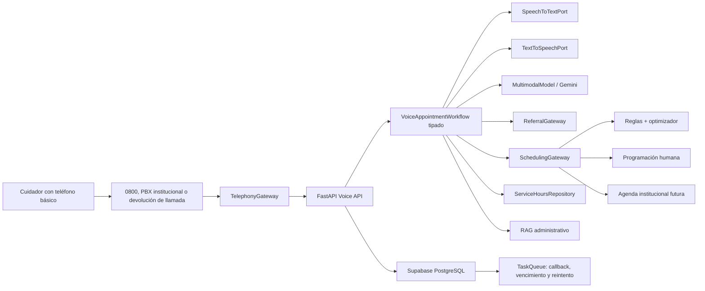
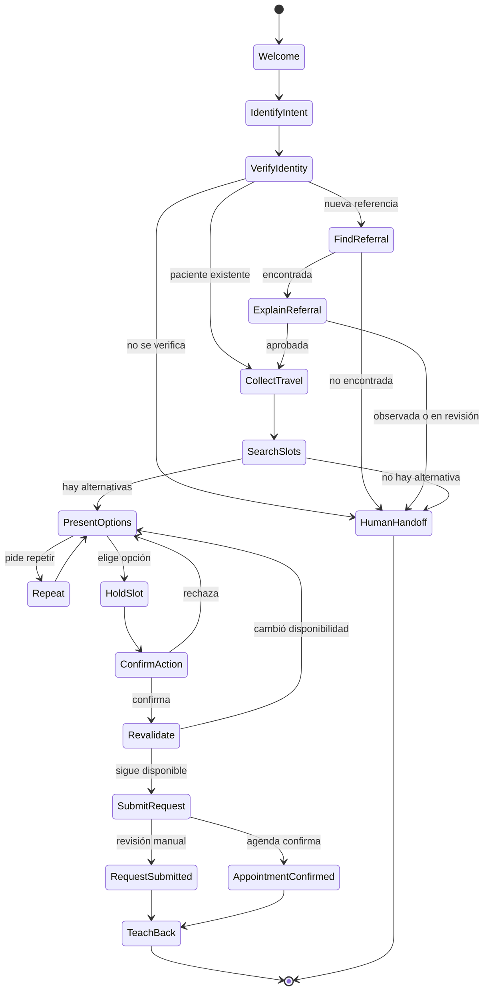

# Kinti — Fase 5: Kinti Voz, referencias y citas accesibles

> [!summary] Resultado de la fase
> Construir un MVP telefónico que permita a un cuidador adulto, incluso si no
> sabe leer o escribir y no tiene internet, consultar el estado de una
> referencia, escuchar horarios institucionales, declarar restricciones de
> viaje, conocer alternativas de cita y confirmar una solicitud mediante la
> voz o el teclado del teléfono. La agenda y el personal autorizado conservan
> la decisión final.

> [!important] Instrucción para Codex
> Ejecuta esta fase como una ampliación incremental de Kinti. No reescribas la
> aplicación ni el backend. Verifica primero la línea base real, implementa una
> sección vertical completa con datos sintéticos y deja la telefonía, el
> reconocimiento de voz, la agenda y las referencias detrás de puertos
> reemplazables. No afirmes que una llamada, referencia o cita real funciona si
> faltan credenciales o integración institucional.

## 1. Problema que debe resolver

Las familias que viajan desde otras regiones pueden no contar con internet,
teléfono inteligente, línea pospago o alfabetización suficiente para completar
formularios. Para ellas, descargar una aplicación, leer un QR o interpretar un
estado administrativo puede convertirse en una barrera para continuar el
tratamiento.

Kinti Voz debe reducir esa barrera sin convertir a la IA en programador clínico.
El cuidador debe poder llamar y recibir acompañamiento oral desde la referencia
regional hasta una cita solicitada o confirmada.

La fase aborda tres resultados del desafío:

1. reducir interrupciones y demoras evitables;
2. sostener la asistencia y el seguimiento; y
3. mejorar la calidad y claridad del proceso de atención.

No promete acortar protocolos ni la duración clínica del tratamiento.

## 2. Línea base que se debe conservar

La fuente de verdad inicial es `phases/BITACORA_FASE_4.md`. Antes de cambiar
código, Codex debe verificar y registrar en `phases/BITACORA_FASE_5.md`:

- rama, commit y estado del árbol de trabajo;
- versiones de Node, Expo, Python, FastAPI y PostgreSQL;
- resultado real de pruebas, lint, typecheck y OpenAPI;
- cabeza actual de Alembic;
- configuración activa de almacenamiento e IA, sin copiar secretos;
- funcionamiento de roles `caregiver`, `care_team` y `patient`; y
- estado del despliegue, Supabase y proveedor de IA.

La bitácora anterior declara como línea base:

- 396 pruebas en verde: 249 backend y 147 móvil;
- 45 rutas únicas y 60 esquemas OpenAPI;
- API desplegada en Render;
- Supabase operativo;
- RAG con citas y abstención;
- Kinti Familia, Kinti Equipo y Kinti Compañero separados; y
- arquitectura del agente de citas documentada, pero no implementada.

Estos valores se deben comprobar; no se copian como resultados nuevos.

## 3. Usuario y frontera de responsabilidad

### Usuario principal

Madre, padre, apoderado u otro cuidador adulto que puede:

- vivir fuera de Lima;
- usar un teléfono básico;
- tener señal intermitente o saldo limitado;
- no saber leer o escribir;
- no conocer un código de referencia;
- expresarse con errores, pausas, ruido o lenguaje cotidiano; y
- necesitar que una persona le repita la información.

### Usuarios secundarios

- personal de Programación o coordinación que revisa excepciones y solicitudes;
- equipo asistencial que consulta el resultado y conserva la prioridad clínica;
- personal de Servicio Social cuando aparece una barrera declarada.

### Exclusión del espacio infantil

Kinti Voz pertenece a Kinti Familia. El rol `patient` no puede consultar
referencias, cupos, citas, barreras ni herramientas telefónicas. El niño no es
responsable de organizar su tratamiento.

## 4. Alcance mínimo del MVP

La primera entrega debe resolver de extremo a extremo estos cinco casos con
datos sintéticos:

1. escuchar el horario de un servicio;
2. localizar una referencia sin exigir que el cuidador lea su código;
3. explicar oralmente si la referencia está recibida, en revisión, observada o
   aprobada;
4. consultar hasta dos alternativas de cita compatibles con restricciones de
   viaje; y
5. confirmar una solicitud o pedir devolución de llamada humana.

El MVP debe funcionar primero mediante un simulador telefónico determinista y,
cuando existan credenciales autorizadas, mediante una llamada real.

### Estados visibles para la familia

- **Orientación:** Kinti solo informa.
- **Referencia en revisión:** todavía no puede ofrecer una cita.
- **Falta un requisito:** Kinti explica qué debe hacer o deriva.
- **Propuesta:** existe una alternativa, pero todavía no está reservada.
- **Solicitud enviada:** Programación o la agenda aún debe responder.
- **Cita confirmada:** solo una fuente autorizada confirmó la reserva.
- **Ayuda humana solicitada:** una persona debe devolver la llamada.

No se utilizarán “registrado”, “procesado” o “éxito” como sustitutos ambiguos de
estos estados.

## 5. Fuera de alcance

- diagnóstico, triaje, prescripción o interpretación de síntomas/resultados;
- modificación de órdenes o protocolos;
- aprobación automática de una referencia;
- priorización clínica por el LLM;
- asignación o traslado automático de médicos;
- confirmación ficticia de cupos;
- uso del rol infantil para organizar citas;
- almacenamiento de grabaciones por defecto;
- biometría de voz;
- conversación clínica libre;
- soporte automático en quechua u otra lengua no evaluada;
- datos reales sin autorización institucional; y
- sustitución de Programación, Admisión, Servicio Social o el equipo clínico.

## 6. Principios de accesibilidad oral

La interfaz no debe suponer lectura. Implementa una política versionada de
conversación con estas reglas verificables:

1. Una pregunta por turno.
2. Máximo dos alternativas habladas por vez.
3. Frases breves y sin jerga.
4. Fechas pronunciadas con día, mes y momento del día.
5. Nunca exigir que la persona lea un SMS, pantalla o código.
6. Permitir responder con voz o DTMF cuando ambas opciones existan.
7. Reconocer siempre: “repita”, “más despacio”, “no entendí”, “volver” y
   “quiero hablar con una persona”.
8. Repetir los datos críticos antes de cualquier escritura.
9. Usar confirmación explícita con “sí”, “no” o una tecla.
10. Después de dos fallos de comprensión, ofrecer una persona o devolución de
    llamada; no mantener un bucle.
11. No reprender, culpar ni mencionar “abandono” al cuidador.
12. No pedir que memorice un código para conservar la cita.
13. No usar una voz infantil para comunicar trámites sensibles.
14. Poder terminar el flujo sin perder una solicitud ya registrada.

No crear un campo `analfabeto`. Usar preferencias no estigmatizantes:

```text
preferred_channel: voice
preferred_language: es-PE
assisted_interaction: true
speech_rate: slow | normal
sms_optional: true | false
```

## 7. Guion conversacional obligatorio

### 7.1 Bienvenida

```text
Hola, soy Kinti. Puedo ayudarle con la referencia y la cita de su niño.
No necesita usar internet ni escribir. ¿Su niño ya se atiende en el instituto?
```

La bienvenida debe indicar que Kinti es un asistente automático y ofrecer
atención humana. No debe mencionar leucemia o diagnóstico antes de verificar la
identidad.

### 7.2 Identificación progresiva

El teléfono de origen solo sirve como pista, no como autenticación suficiente.
Admitir, en orden configurable:

1. coincidencia con teléfono previamente registrado;
2. DNI dictado dígito por dígito;
3. nombre y fecha de nacimiento;
4. establecimiento y región que emitieron la referencia; y
5. revisión humana si la coincidencia no es segura.

Repetir el DNI en grupos y pedir confirmación. Limitar intentos, aplicar rate
limit y no revelar si existe una persona concreta hasta verificar la relación.

### 7.3 Referencia

Preguntar de forma simple:

```text
¿En qué hospital atendieron a su niño?
```

No exigir número de referencia. Si existe, se puede aceptar como dato opcional.

Respuestas canónicas:

- `RECEIVED`: “La referencia llegó y todavía está siendo revisada”.
- `IN_REVIEW`: “La referencia está en revisión. Aún no puedo ofrecer una cita”.
- `OBSERVED`: “Falta completar un requisito. Le explicaré cuál”.
- `APPROVED`: “La referencia fue aprobada. Ahora buscaré una cita”.
- `NOT_FOUND`: “No pude encontrarla con seguridad. Pediré que una persona la revise”.

El LLM puede reformular; el estado y la acción provienen del dominio.

### 7.4 Viaje desde provincia

Recoger únicamente lo necesario:

- departamento y provincia declarados;
- fecha o ventana posible de llegada;
- fecha máxima de retorno;
- tiempo aproximado de viaje, si la familia lo conoce;
- necesidad declarada de alojamiento o transporte; y
- posibilidad de permanecer más de un día.

No inferir pobreza, riesgo o prioridad desde la procedencia.

### 7.5 Alternativas

Ofrecer como máximo dos opciones factibles. Cada opción se pronuncia así:

```text
Opción uno. Lunes veinticuatro de agosto, a las diez de la mañana.
Puede realizar el análisis ese mismo día, a las ocho.
```

La continuidad con el equipo asignado y las reglas clínicas son restricciones
prioritarias. Solo después puede considerarse equilibrio de carga entre
profesionales equivalentes, menor espera y menor número de viajes.

### 7.6 Confirmación y teach-back

Antes de enviar o confirmar:

```text
Voy a repetir. Usted eligió el lunes veinticuatro, análisis a las ocho y
consulta a las diez. ¿Desea continuar?
```

Después:

```text
Para asegurarme de haber explicado bien, ¿qué día vendrá?
```

El teach-back verifica la explicación de Kinti; no debe presentarse como examen
al cuidador. Si falla, Kinti vuelve a explicar una vez y ofrece apoyo humano.

## 8. Fuentes de verdad

| Información | Fuente correcta | Prohibido |
|---|---|---|
| Horario general de un servicio | tabla versionada o documento institucional publicado | inventarlo desde el modelo |
| Requisitos administrativos | RAG aprobado, vigente y citado internamente | usar texto no publicado |
| Estado de referencia | `ReferralGateway` | embeddings o memoria del chat |
| Cupos actuales | `SchedulingGateway` | RAG o respuesta libre |
| Orden/atención autorizada | dominio operativo | inferencia del LLM |
| Restricciones de viaje | declaración del cuidador | inferirlas por región |
| Cita confirmada | respuesta de agenda autorizada | asumirla por un `200` local |
| Ubicación y puerta de ingreso | dato institucional versionado | indicación improvisada |

Los horarios generales deben distinguirse de los cupos. Que Hematología atienda
de 8:00 a 14:00 no significa que exista una cita disponible a las 10:00.

## 9. Arquitectura objetivo



### Decisión para salir rápido

Implementar en dos incrementos sin desechar trabajo:

#### Fase 5A — llamada por turnos

- webhook de llamada entrante;
- una pregunta y una respuesta por turno;
- voz y teclado mediante un adaptador tipo TwiML `<Gather>`;
- respuesta hablada mediante TTS del proveedor;
- máquina de estados propia y tipada;
- `FakeTelephonyGateway` y adaptador Twilio;
- agenda y referencias sintéticas/manuales.

Este incremento es el MVP obligatorio porque permite una llamada real con menos
infraestructura y deja validar el lenguaje accesible.

#### Fase 5B — conversación en tiempo real

- audio bidireccional por WebSocket/Media Streams;
- STT `es-PE` optimizado para telefonía;
- TTS configurable;
- interrupción de la voz de Kinti;
- detección de silencio y latencia;
- misma máquina de estados y mismas herramientas.

No comenzar 5B hasta que 5A pase los casos críticos. El transporte cambia; el
dominio y el flujo no.

## 10. Puertos obligatorios

Definir interfaces sin dependencias de Twilio, Google o Supabase en el dominio:

```python
class TelephonyGateway(Protocol): ...
class SpeechToTextPort(Protocol): ...
class TextToSpeechPort(Protocol): ...
class ReferralGateway(Protocol): ...
class SchedulingGateway(Protocol): ...
class ServiceHoursRepository(Protocol): ...
class VoiceAppointmentWorkflow(Protocol): ...
class TaskQueue(Protocol): ...
```

Implementaciones iniciales:

- `FakeTelephonyGateway`;
- `TwilioTurnTelephonyGateway`;
- `FakeReferralGateway`;
- `ManualReferralGateway`;
- `FakeSchedulingGateway`;
- `ManualSchedulingGateway`;
- `DatabaseServiceHoursRepository`;
- `FakeSpeechToText` y `FakeTextToSpeech` para pruebas;
- adaptadores reales solo cuando existan credenciales autorizadas.

`InstitutionalReferralGateway` e `InstitutionalSchedulingGateway` quedan como
interfaces hasta conocer los contratos reales.

## 11. Responsabilidad de Gemini

Gemini puede:

- clasificar intención;
- interpretar lenguaje cotidiano;
- extraer campos candidatos;
- detectar una petición de repetición, lentitud o ayuda humana;
- producir una frase simple a partir de un resultado canónico; y
- elegir una herramienta de una lista cerrada.

Gemini no puede:

- cambiar el estado de una referencia;
- aprobar requisitos;
- generar cupos;
- decidir prioridad clínica;
- escribir directamente en PostgreSQL;
- elegir un médico fuera de reglas institucionales;
- afirmar que existe una cita; ni
- responder preguntas clínicas.

Toda salida del modelo debe validarse con Pydantic. Las operaciones críticas
deben funcionar con el proveedor `fake`; una caída de Gemini no puede impedir
consultar una cita ya confirmada ni pedir ayuda humana.

## 12. Modelo de datos mínimo

Crear una única migración incremental de Fase 5. Los nombres finales pueden
ajustarse al estilo del repositorio, conservando estas responsabilidades.

### `service_hours`

- servicio, sede y ubicación hablable;
- zona horaria;
- día de semana, apertura y cierre;
- vigencia y versión;
- estado publicado/retirado;
- fuente administrativa.

### `referral_cases`

- paciente y establecimiento de origen;
- región/provincia declarada;
- especialidad solicitada;
- estado canónico;
- requisitos faltantes codificados;
- identificador externo opcional;
- última sincronización y procedencia del dato.

Usar solo datos sintéticos hasta autorización.

### `appointment_requests`

- paciente, cuidador y tipo de solicitud;
- estado canónico;
- referencia relacionada;
- origen `voice`, `app` o `staff`;
- `operation_id` único;
- propuesta elegida y vencimiento;
- resultado externo opcional.

### `appointment_holds`

- slot y solicitud;
- expiración;
- versión de disponibilidad;
- estado `held`, `consumed`, `expired` o `released`.

### `voice_sessions`

- identificador del proveedor seudonimizado;
- estado actual del flujo;
- actor y paciente solo después de verificación;
- idioma y velocidad preferidos;
- consentimiento y resultado;
- cantidad de reintentos;
- motivo de transferencia;
- inicio y fin.

No guardar audio ni transcripción completa por defecto.

### `callback_requests`

- teléfono cifrado o referenciado mediante el mecanismo existente;
- actor/paciente cuando estén verificados;
- motivo codificado;
- estado, SLA y asignación humana;
- idempotencia y auditoría.

## 13. Estados del flujo



Persistir el estado después de cada operación significativa. Reintentar un
webhook no debe duplicar sesiones, solicitudes, holds o callbacks.

## 14. API nueva

Agregar bajo `/api/v1` sin romper contratos existentes:

```text
POST /voice/incoming
POST /voice/turn
POST /voice/status
POST /voice/callback-requests
GET  /voice/sessions/{session_id}

GET  /service-hours
GET  /referrals/{referral_id}
POST /referrals/lookup

POST /appointment-requests
GET  /appointment-requests/{request_id}
POST /appointment-requests/{request_id}/proposals
POST /appointment-requests/{request_id}/confirm
POST /appointment-requests/{request_id}/human-handoff
```

La ruta WebSocket para 5B se añade solo al implementar streaming:

```text
WS /voice/media/{session_id}
```

Reglas:

- validar la firma del proveedor telefónico;
- no autenticar al cuidador solo por Caller ID;
- separar endpoints del proveedor y casos de uso internos;
- exigir `operation_id` en escrituras;
- revalidar slot y autorización al confirmar;
- devolver estados canónicos, no texto libre como fuente de verdad;
- mantener las rutas administrativas protegidas por rol; y
- regenerar OpenAPI al cerrar cada incremento.

## 15. Configuración

Agregar variables documentadas, sin secretos reales en Git:

```dotenv
KINTI_TELEPHONY_PROVIDER=fake
KINTI_VOICE_MODE=turn
KINTI_VOICE_LANGUAGE=es-PE
KINTI_VOICE_DEFAULT_SPEECH_RATE=slow
KINTI_VOICE_MAX_CALL_SECONDS=480
KINTI_VOICE_MAX_REPROMPTS=2
KINTI_VOICE_RECORDING_ENABLED=false
KINTI_VOICE_TRANSCRIPT_RETENTION_ENABLED=false
KINTI_VOICE_CALLBACK_ENABLED=true

KINTI_REFERRAL_PROVIDER=fake
KINTI_SCHEDULING_PROVIDER=fake
KINTI_STT_PROVIDER=fake
KINTI_TTS_PROVIDER=fake

TWILIO_ACCOUNT_SID=
TWILIO_AUTH_TOKEN=
TWILIO_PHONE_NUMBER=
TWILIO_WEBHOOK_BASE_URL=
```

No registrar valores de credenciales. Aplicar timeout, circuit breaker y límite
de duración. Si el proveedor falla, registrar una devolución de llamada o
transferir; no confirmar una operación incompleta.

## 16. Seguridad, privacidad y protección clínica

- No grabar llamadas por defecto.
- No persistir transcripción completa por defecto.
- Guardar eventos estructurados: intención, herramienta, resultado y estado.
- Enmascarar número telefónico, DNI y nombre en logs.
- Separar identidad del contenido de conversación.
- No decir diagnóstico, especialidad sensible o nombre completo antes de
  verificar al cuidador.
- Limitar intentos y bloquear enumeración de pacientes/referencias.
- No enviar identificadores directos al modelo si basta un ID seudónimo.
- No indexar referencias, citas, viajes o conversaciones en `pgvector`.
- Mantener requisitos administrativos publicados y versionados.
- Ante síntomas o preguntas clínicas, usar un mensaje institucional estático y
  transferir; no realizar triaje generativo.
- Ofrecer persona humana en cualquier estado.
- Documentar retención, región y terceros antes de usar datos reales.

## 17. Distribución de médicos

El agente no “reparte médicos” libremente. El buscador de alternativas recibe:

- profesional o equipo responsable;
- especialidad y competencias equivalentes autorizadas;
- continuidad requerida;
- disponibilidad institucional;
- carga/capacidad validada; y
- reglas de sustitución aprobadas.

Orden de decisión:

1. seguridad y reglas clínicas;
2. continuidad con responsable/equipo;
3. factibilidad de la referencia y orden;
4. disponibilidad real;
5. restricciones de viaje;
6. menor espera y menos desplazamientos; y
7. equilibrio de carga entre opciones clínicamente equivalentes.

La propuesta debe explicar qué criterio logístico aplicó, sin revelar carga o
datos internos al cuidador. Toda excepción se deriva a una persona.

## 18. Datos sintéticos obligatorios

Crear seed idempotente con al menos:

- tres establecimientos de origen de regiones distintas;
- cinco servicios con horarios versionados;
- seis referencias que cubran todos los estados;
- dos pacientes existentes con restricciones de viaje diferentes;
- ocho slots, incluyendo conflicto, vencimiento y falta de cupo;
- dos profesionales equivalentes y uno no equivalente;
- una solicitud que necesita albergue;
- una llamada que pide repetición;
- una llamada con dos fallos de reconocimiento; y
- una consulta clínica que debe transferirse.

No usar nombres, DNI, teléfonos o historias reales.

## 19. Orden de implementación

### Paso 0 — auditoría y bitácora

- Leer `AGENTS.md`, `CLAUDE.md`, README, Fase 4, su bitácora y ADR 0003.
- Preservar cambios del usuario.
- Ejecutar la línea base completa.
- Crear `phases/BITACORA_FASE_5.md` desde el primer comando.

### Paso 1 — ADR y lenguaje accesible

- Crear `docs/adr/0004-kinti-voz-accesible.md`.
- Congelar estados, frases críticas y política oral.
- Definir qué es orientación, propuesta, solicitud y confirmación.
- Documentar Fase 5A y 5B.

### Paso 2 — contratos y fakes

- Crear puertos, esquemas Pydantic y máquina de estados.
- Implementar proveedores `fake` deterministas.
- Probar el flujo completo sin IA, red ni telefonía externa.

### Paso 3 — datos operativos

- Crear migración, modelos, repositorios, RLS/privilegios y seed.
- Implementar horarios, referencias, solicitudes, holds, sesiones y callbacks.
- Mantener datos dinámicos fuera del RAG.

### Paso 4 — dominio de referencia y cita

- Implementar lookup seguro y explicación canónica de referencia.
- Implementar consulta, hold, revalidación e idempotencia de slots.
- Crear `ManualReferralGateway` y `ManualSchedulingGateway`.
- Conectar barreras declaradas con el circuito existente sin cerrarlas en falso.

### Paso 5 — simulador telefónico

- Construir un harness de llamadas por turnos reproducible.
- Permitir voz simulada, DTMF, repetición, lentitud y transferencia.
- Ejecutar todos los guiones sintéticos antes de integrar Twilio.

### Paso 6 — llamada real Fase 5A

- Implementar webhook entrante y adaptador Twilio por turnos.
- Validar firmas y reintentos.
- Configurar un número de prueba solo con autorización y presupuesto.
- Completar al menos una llamada real de extremo a extremo.
- Si faltan credenciales, dejar el adaptador listo, probarlo contractualmente y
  registrar el bloqueo sin afirmar que se hizo la llamada.

### Paso 7 — Gemini controlado

- Reutilizar `MultimodalModel`.
- Añadir extracción tipada e intenciones de voz.
- Mantener estados y acciones en el dominio.
- Probar caída, timeout, salida malformada y herramienta no permitida.
- Conservar un modo `fake` completo.

### Paso 8 — integración móvil y equipo

- Mostrar solicitudes telefónicas en Kinti Equipo.
- Permitir que el cuidador vea en Kinti Familia una solicitud creada por voz,
  pero no exigir la aplicación para terminar el trámite.
- Sincronizar estados y última actualización.
- Mantener el rol `patient` fuera de todo el circuito.

### Paso 9 — evaluación y despliegue

- Ejecutar seguridad, accesibilidad, regresión y concurrencia.
- Regenerar OpenAPI.
- Desplegar solo después de migración y configuración autorizadas.
- Verificar el circuito remoto sin datos reales.
- Completar bitácora, runbook, costos y limitaciones.

### Paso 10 — Fase 5B opcional

- Implementar streaming solo si 5A cumple las puertas.
- Mantener los mismos casos de uso y fuentes de verdad.
- Medir latencia, interrupción, ruido y costo antes de declararlo mejor.

## 20. Pruebas obligatorias

### Regresión

- todas las pruebas heredadas siguen pasando;
- Android y web siguen compilando/exportando;
- roles y aislamiento de Fase 4 permanecen intactos;
- migración desde base vacía y desde el `head` de Fase 4.

### Referencias

- cada estado produce la acción canónica correcta;
- una referencia no encontrada no revela datos parciales;
- una referencia observada no genera slots;
- una referencia aprobada no equivale a cita;
- reintentos no duplican la solicitud de revisión.

### Horarios y citas

- horario general no se confunde con cupo;
- solo se ofrecen slots vigentes y autorizados;
- máximo dos opciones por turno;
- hold vencido obliga a consultar de nuevo;
- cambio de cupo antes de confirmar;
- reintento de webhook no duplica cita;
- `solicitud enviada` y `cita confirmada` son estados distintos;
- el optimizador respeta continuidad, equivalencia y viaje.

### Accesibilidad oral

- ninguna ruta exige leer una pantalla o SMS;
- fechas completas y no ambiguas;
- una pregunta por turno;
- “repita” reproduce la última instrucción;
- “más despacio” cambia la preferencia;
- “no entendí” simplifica el mensaje;
- “quiero una persona” siempre transfiere;
- dos fallos generan callback/handoff;
- teach-back fallido no cancela ni culpa;
- DTMF y voz producen el mismo estado cuando corresponde.

### Seguridad

- firma telefónica inválida rechazada;
- Caller ID no autentica por sí solo;
- enumeración de DNI/referencias limitada;
- cuidador no accede a otra familia;
- rol `patient` recibe 403 en rutas de voz/citas;
- logs sin teléfono, DNI, audio ni transcripción completa;
- prompt injection no modifica herramientas o políticas;
- consulta clínica se transfiere sin respuesta generativa;
- caída del proveedor nunca produce confirmación falsa.

### Telefonía

- webhook repetido;
- llamada cortada y reanudación segura;
- silencio y ruido;
- respuesta fuera de contexto;
- duración máxima;
- proveedor no disponible;
- callback idempotente; y
- llamada real documentada, si existen credenciales.

## 21. Puertas de evaluación

Puertas técnicas propuestas para datos sintéticos:

- 0 citas falsamente confirmadas;
- 0 referencias aprobadas por el modelo;
- 100 % de comandos de ayuda humana producen handoff/callback;
- 100 % de acciones de escritura requieren confirmación y revalidación;
- 100 % de fechas críticas se pronuncian sin formato numérico ambiguo;
- 100 % de rutas del rol `patient` permanecen bloqueadas;
- ningún guion requiere pantalla, lectura o escritura;
- intención correcta en al menos 90 % del set oral sintético, reportando los
  errores por separado; y
- tasa de finalización y cantidad de repreguntas registradas sin contenido
  sensible.

Realizar al menos cinco pruebas moderadas con adultos usando datos ficticios e
incluir participantes con distintos niveles de alfabetización digital. No
etiquetar ni exponer su alfabetización. Registrar dónde Kinti confundió,
apresuró o sobrecargó la conversación y corregir primero el flujo.

## 22. Observabilidad y costos

Registrar sin contenido sensible:

- duración y resultado de la llamada;
- estado donde terminó;
- cantidad de repeticiones y fallos de reconocimiento;
- latencia por STT, modelo, herramienta y TTS;
- transferencia humana y motivo codificado;
- costo estimado de telefonía, STT, TTS e inferencia; y
- solicitudes estancadas o callbacks fuera de SLA.

Configurar alertas por:

- tasa de error de webhooks;
- confirmaciones fallidas;
- sesiones atrapadas;
- presupuesto diario/mensual;
- latencia elevada; y
- solicitudes sin respuesta humana.

Comparar para producción:

1. PBX/SIP institucional;
2. línea gratuita de operador peruano;
3. devolución de llamada; y
4. Twilio para prototipo.

No fijar una decisión de telefonía productiva sin validar cobertura, costo,
compras y protección de datos con el INSNSB.

## 23. Guion de demostración

1. Llamar desde un teléfono sin abrir la aplicación.
2. Kinti explica que no se necesita internet ni escribir.
3. El cuidador dice: “Nos mandaron desde Puno”.
4. Kinti localiza una referencia sintética sin pedir su código.
5. Explica oralmente que está aprobada.
6. Pregunta cuándo puede llegar y si puede permanecer más de un día.
7. Consulta cupos sintéticos y ofrece dos opciones.
8. El cuidador dice “repita más despacio”.
9. Kinti repite, el cuidador elige y confirma.
10. El sistema revalida y anuncia “solicitud enviada” o “cita confirmada” según
    la respuesta real del gateway.
11. Kinti realiza teach-back.
12. La solicitud aparece en Kinti Equipo con trazabilidad e idempotencia.
13. Repetir el webhook y mostrar que no se duplica.
14. Mostrar una referencia observada que deriva a una persona.
15. Mostrar que una pregunta clínica no recibe una respuesta inventada.

## 24. Puertas institucionales

Antes de usar datos o llamadas reales, obtener definición/aprobación de:

1. número telefónico, PBX, SIP o proveedor;
2. costo y responsable presupuestal;
3. fuente oficial de horarios y ubicaciones;
4. fuente y estados oficiales de referencias;
5. fuente de cupos y contrato de reserva;
6. reglas de identidad del cuidador;
7. permisos para solicitar, reprogramar y cancelar;
8. mensajes de seguridad y transferencia clínica;
9. equipo receptor, horario y SLA de callbacks;
10. retención de audio, transcripción y metadatos;
11. idiomas y derivación a personal bilingüe; y
12. reglas de continuidad y equilibrio entre profesionales equivalentes.

Si estas decisiones faltan, usar fakes y cola manual. Documentar la puerta; no
rellenarla con una decisión técnica no autorizada.

## 25. Definición de terminado

### MVP ejecutable

- [x] Línea base verificada y registrada.
- [x] ADR 0004 aprobado en el repositorio.
- [x] Política oral accesible versionada y probada.
- [x] Puertos y proveedores fake implementados.
- [x] Horarios, referencias, solicitudes, holds y callbacks migrados.
- [x] Seed sintético idempotente.
- [x] Flujo completo funciona en simulador sin pantalla.
- [x] Estados visibles son inequívocos.
- [x] Confirmación, revalidación e idempotencia funcionan.
- [x] Handoff/callback funciona desde cualquier estado.
- [x] Kinti Equipo recibe solicitudes telefónicas.
- [x] Rol `patient` no accede al circuito.
- [x] Pruebas, lint, typecheck y OpenAPI en verde.

### MVP telefónico

- [ ] Webhooks del proveedor validados y firmados.
- [ ] Llamada real por turnos completada con datos sintéticos.
- [ ] Voz y DTMF verificados.
- [ ] Una interrupción o caída no duplica acciones.
- [ ] Costos y latencia medidos.
- [ ] Despliegue remoto y rollback documentados.

Si faltan credenciales, marcar el MVP ejecutable como terminado y el MVP
telefónico como bloqueado por dependencia externa. No declarar completa la
llamada real.

## 26. Entregables

- `phases/BITACORA_FASE_5.md`;
- `docs/adr/0004-kinti-voz-accesible.md`;
- migración Alembic incremental;
- módulo de voz y máquina de estados;
- módulos de horarios, referencias y solicitudes;
- puertos y adaptadores fake/manual/telefonía;
- endpoints y OpenAPI actualizado;
- cola de callbacks y vista en Kinti Equipo;
- seed y dataset oral sintético;
- pruebas de dominio, API, seguridad y accesibilidad;
- simulador/harness reproducible;
- runbook de número, webhook, proveedor, despliegue y rollback;
- estimación de costos por 100, 1 000 y 10 000 llamadas; y
- guion de demostración reproducible.

## 27. Referencias técnicas

- [Twilio Media Streams](https://www.twilio.com/docs/voice/media-streams)
- [Twilio Programmable Voice — precios de Perú](https://www.twilio.com/en-us/voice/pricing/pe)
- [Google Cloud Speech-to-Text — idiomas](https://cloud.google.com/speech-to-text/v2/docs/speech-to-text-supported-languages)
- [Google Cloud Speech-to-Text — precios](https://cloud.google.com/speech-to-text/pricing)
- [Google Cloud Text-to-Speech — precios](https://cloud.google.com/text-to-speech/pricing)
- [Vertex AI — function calling](https://cloud.google.com/vertex-ai/generative-ai/docs/multimodal/function-calling)

## 28. Instrucción corta para iniciar a Codex

> Ejecuta `phases/KINTI_FASE_5_KINTI_VOZ_CODEX.md` desde el repositorio de
> Kinti. Lee primero `phases/BITACORA_FASE_4.md`, la Fase 4 y el ADR 0003.
> Conserva el monolito modular y el árbol de trabajo. Empieza por la máquina de
> estados, los puertos y los fakes; crea después horarios, referencias,
> solicitudes y el simulador. Implementa la llamada por turnos antes del
> streaming. Usa solo datos sintéticos, no grabes audio, no confundas horario
> con cupo y no llames “cita confirmada” a una solicitud. Verifica el flujo sin
> pantalla para una persona que no sabe leer, exige confirmación e idempotencia
> y documenta honestamente cualquier bloqueo de credenciales o integración.
